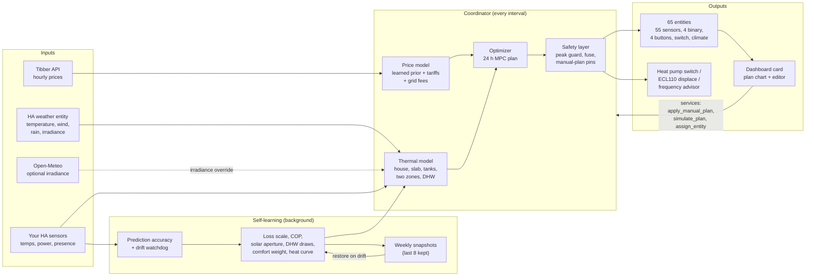
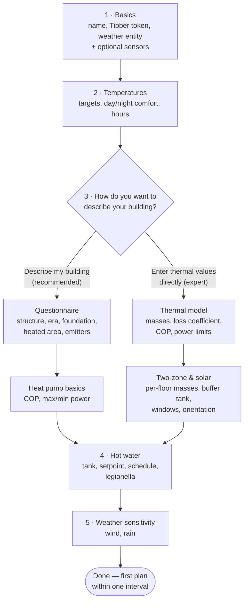
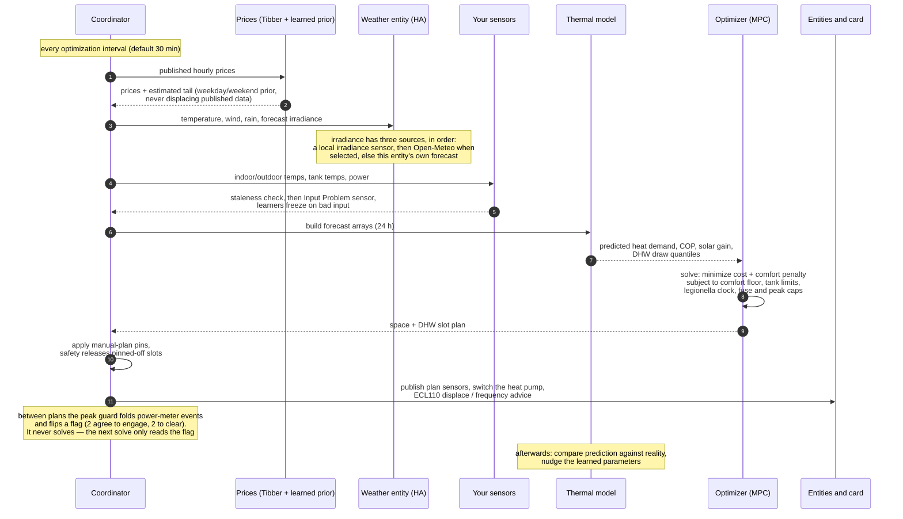

# Heat Pump Cost Optimizer for Home Assistant

Model-predictive heating control for Home Assistant. It plans your heat pump and
your hot water 24 hours ahead against hourly electricity prices, the weather
forecast, and a thermal model of your own house that it keeps correcting from
your own sensors — so the house stays as warm as you asked, bought in better
hours.

[](https://hacs.xyz)
[](https://www.home-assistant.io)
[](LICENSE)

<!-- Hero image: a screenshot of the dashboard card belongs here. None is
     committed yet; see docs/dashboard-card.md for what the card looks like. -->

## Acknowledgement

This project began as a fork of
[**strutsfarm/heatpump_optimizer**](https://github.com/strutsfarm/heatpump_optimizer)
at version 2.2.0. The MPC formulation, the two-zone thermal model with its slab
and buffer tank, the Tibber and weather integration, the config flow and the
ECL110 heat-curve path are all originally strutsfarm's work; the companion
[**strutsfarm/ecl110**](https://github.com/strutsfarm/ecl110) project provides
the MQTT interface this integration drives. Versions 2.3.0 onward were developed
in this fork. Both projects are MIT licensed. The formal attribution is recorded
in [NOTICE](NOTICE), and [LICENSE](LICENSE) is kept as the verbatim MIT text.

## What it does



**Plans ahead instead of reacting.** A 24-hour model-predictive plan is re-solved
on every interval against the full forecast trajectory, not against the weather
right now. Space heating and hot water share one compressor, so they are planned
against each other rather than one after the other, and every planned slot
carries a reason code you can read off the card.

**Learns your house.** The heat-loss scale, tank cooling rates, the COP curve and
its defrost derate, the solar aperture, internal gains, how the loss splits
between floors, your hot-water draw statistics, your revealed comfort preference,
and a cool-only heat-curve correction of at most 0.5 K per week are all estimated
from your own house. Every learner is snapshotted weekly (the last eight are
kept), and a drift watchdog can roll them back to the last healthy snapshot.

**Knows what your electricity actually costs.** Tibber spot prices, time-of-use
grid transfer fees, the monthly capacity (*effekt*) tariff and its billing clock,
PV self-consumption priced at what consuming actually costs you, and a learned
diurnal price prior for the part of the horizon that has not been published yet.
A live peak guard and a main-fuse headroom advisor act inside the metering window
the plan never saw, and a contract comparison settles the month three ways so you
can see what your tariff choice is worth.

**Handles real plumbing.** A mixing valve is what lets a buffer tank store
anything, so it is modelled explicitly. A wood furnace tank is a store of its
own, drawn wood-first while it is usable, with an optional hot-water inlet coil.
Your hydronic layout is picked from a catalog of drawn arrangements rather than
described in prose, and circulation pumps — the hot-water loop and the space
pump — are scheduled instead of left running.

**Hot water that fits your household.** Hot water is guaranteed inside demand
time frames rather than kept permanently hot, which is where most of the saving
comes from. Draw statistics are learned per window, with a heavy-day (90th
percentile) target so the second shower is not the one that runs cold. A setpoint
advisor proposes the cheapest setpoint that still covers those days; a mixed-water
sensor translates the tank into litres and shower minutes; anti-legionella can be
elastic, and takes the free disinfection when a burn or a cheap hour delivers it
anyway.

**Shows its work.** The plan is published as sentences grouped by reason, and
graded 0–100 across envelope, machine and operation. Energy and cost accumulate
into the Energy dashboard split by hot water versus space heating. Prediction
accuracy carries a signed bias, and a one-shot diagnosis attributes the last
interval's temperature error input by input. Compressor starts are counted from
the meter, and the wear they imply is priced rather than assumed.

**You stay in charge.** The card's editor pins exact run slots for up to 20 hours
and the optimizer plans around them; a what-if simulator prices a comfort change
before you commit to it; a climate entity and a switch give you the ordinary
Home Assistant controls. Compressor frequency control is deliberately two-stage:
it observes and advises until you explicitly turn writing on.

**Stays out of trouble.** A staleness watchdog treats a sensor that stopped
updating as missing and pauses learning rather than training on a flatline. Open
windows are detected and freeze the learners. Away and holiday mode sets back
deeply and buys the recovery heat in the cheapest hours before you get home. An
optional mould guard watches surface humidity. Safety — tank minimums, the
legionella clock, the comfort floor — releases pinned slots it cannot honour and
tells you which.

**Fits your Home Assistant.** Since v5.0.0 entity names are translated (English
and Swedish) and follow your Home Assistant language, without touching entity ids
or history. Monetary units follow your instance currency.

## Requirements

- Home Assistant 2024.6.0 or newer (the release that gave config entries
  their `runtime_data`, which every platform here reads its coordinator from)
- A Tibber account with API access ([developer.tibber.com](https://developer.tibber.com))
- A weather integration with hourly forecasts (Met.no or similar)
- `numpy` and `scipy`, installed automatically from the integration manifest

Everything else — indoor and outdoor thermometers, tank probes, a power meter —
is optional. The optimizer runs without them and gets steadily better with each
one you add.

## Installation

### Minimum Home Assistant version

Issue #227 re-verified the `hacs.json` floor rather than raising it:
**2024.6.0 stays the minimum**, because `ConfigEntry.runtime_data` — read by
every platform here — is still the only API in this integration with a
minimum Home Assistant release established from evidence in this repository
(`tests/hastub/homeassistant/config_entries.py`'s docstring and
`RELEASE_NOTES.md`'s v6.3.0 entry, which records that release as verified
against the upstream `home-assistant/core` tags). The reconfigure flow,
config-flow sections, and icon translations queued behind issues #196 and
#189 may raise this floor again once their own minimum releases are
established — none is pinned anywhere in this repository yet, so this audit
left the floor where the evidence actually supports it rather than guess.

### HACS (recommended)

1. Add this repository to HACS as a custom repository.
2. Install **Heat Pump Cost Optimizer**.
3. Restart Home Assistant.
4. Go to **Settings → Devices & services → Add integration → Heat Pump Cost
   Optimizer**.

### Manual

1. Copy `custom_components/heatpump_optimizer` into your Home Assistant
   `custom_components` folder.
2. Restart Home Assistant.
3. Add the integration from the UI as above.

### Removal

The integration follows Home Assistant's standard removal: **Settings →
Devices & services → Heat Pump Cost Optimizer → ⋮ → Delete**, once per entry
if you set up more than one heat pump. Deleting the entry removes its device
and every one of its entities and stops every command to the heat pump. Three
things are left behind on purpose, because deleting them is your call:

- **The heat pump keeps its last command.** The last setpoint the optimizer
  wrote to your thermostat, or the last ECL110 displacement it published, stays
  in force until you set the pump's own controls back. Nothing is restored on
  removal.
- **The learned state.** Every entry keeps its learners and ledgers in ten files
  under `.storage/` in your configuration directory, and Home Assistant does not
  delete an integration's store files with the entry:
  `heatpump_optimizer_<entry id>_thermal_learning`,
  `heatpump_optimizer_<entry id>_price_model`,
  `heatpump_optimizer_<entry id>_accuracy`,
  `heatpump_optimizer_<entry id>_ledger`,
  `heatpump_optimizer_<entry id>_energy`,
  `heatpump_optimizer_<entry id>_snapshots`,
  `heatpump_optimizer_<entry id>_dhw_profile`,
  `heatpump_optimizer_<entry id>_dhw_draws`,
  `heatpump_optimizer_<entry id>_dhw_legionella` and
  `heatpump_optimizer_<entry id>_manual_plan`. Delete them by hand for a clean
  slate; a re-added entry gets a new id and never reads them.
- **The dashboard card.** The Lovelace resource the integration registered,
  `/heatpump_optimizer_static/heatpump-optimizer-card.js`, stays in
  **Settings → Dashboards → ⋮ → Resources**. Remove it there once no dashboard
  uses the card; a card left on a dashboard shows "Custom element doesn't
  exist" afterwards.

Then uninstall the code: in HACS, open **Heat Pump Cost Optimizer** and choose
**Remove** (for a manual install, delete `custom_components/heatpump_optimizer`),
and restart Home Assistant. Nothing needs doing on Tibber's side — the token was
only ever stored in the entry — though you can revoke it at
[developer.tibber.com](https://developer.tibber.com) if you like. Recorded
history of the entities stays until the recorder purges it, as for any removed
integration.

## Quick start — the first 30 minutes

Have your Tibber token and the entity id of your weather integration to hand.
Everything else can be added later from the options pages.



**1 · Basics.** A name, your Tibber token (it is validated before the flow
continues) and your weather entity are required. Everything else on this page is
optional and can be pointed at later: indoor and outdoor temperature sensors, a
switch that turns the heat pump on and off, a solar irradiance sensor or an
Open-Meteo location, the floor-heating return temperature, a lower-floor
thermometer, and the hot-water and buffer tank probes.

**2 · Temperatures.** Your target (21 °C), the band you allow around it, and the
comfort temperatures for day (21 °C) and night (19.5 °C) with the hours the day
runs (07:00–22:00). The width of the band is the single biggest lever you have:
a wide one gives the optimizer room to shift heating into cheap hours, a narrow
one keeps the house near the setpoint.

**3 · How to describe your building.** This is a choice, not a step.

- **Describe my building (recommended)** asks what your house is made of —
  structure, era, foundation, heated area, and what each floor is heated by —
  and derives the physics from building archetypes. Then it asks for three
  numbers off the heat pump's nameplate: nominal COP, maximum power, minimum
  power. That is the whole path.
- **Enter thermal values directly** is the expert branch, for someone holding a
  real energy declaration. It asks for thermal masses, the heat-loss coefficient,
  the slab parameters and the power limits, and then for the two-zone and solar
  values: per-floor masses and losses, inter-zone transfer, the radiator power
  fraction, buffer tank volume, window area, orientation factor and SHGC.

Both paths land on the same model, and every value either one sets can be edited
afterwards — though not all on one page. The masses, losses, the two-zone split
and the power limits are on **Advanced settings → Thermal model (expert)**;
buffer tank volume is on **Heating system and heat storage**; window area,
orientation factor and SHGC are on **Building type and emitters**.

**4 · Hot water.** Tank volume, setpoint and minimum, daily consumption, and the
demand time frames — the periods when hot water must be available (`06:00-08:30,
17:00-22:00` by default). Outside them the tank is *meant* to cool down; that is
where most of the savings come from. Leave the field empty to let the optimizer
learn the frames from observed usage, or turn the toggle off to require hot water
around the clock. Anti-legionella is on by default at 60 °C every 7 days; that
temperature applies only during a cycle, so the rest of the week the tank is
never charged above the limit you set.

**5 · Weather sensitivity.** How much wind and rain raise your heat loss.
The defaults (3 % per m/s of wind, 15 % while raining) are a reasonable
starting point for a detached house.

Every field and its range is documented in
[docs/configuration.md](docs/configuration.md).

### Your first week

- **Immediately.** All 65 entities appear and the first plan is solved within one
  optimization interval (30 minutes by default). Add the dashboard card and you
  can see what it intends to do.
- **Day one.** If you want the commissioning step test, first switch on *Allow a
  one-off measurement experiment* under **Advanced settings → Self-learning and
  diagnostics**: it is off on a fresh install, and until it is on, **Run System
  Identification** does nothing but log that identification is disabled. With the
  option enabled, press the button and the test arms itself and runs on the next
  mild, cheap night.
- **The first days.** The heat-loss scale, tank cooling rates and the COP curve
  start correcting themselves as soon as there is data to correct them with.
  Watch **Prediction Accuracy** and **Input Problem**.
- **The first weeks.** Hot-water draw quantiles and the heavy-day demand sensor
  need weeks of observation before they mean anything, and stay unavailable
  until they do.

## Entities

All entities are created on every install. Where a feature is not configured, the
entity exists but reports itself unavailable, so nothing appears and disappears
under your dashboards. Six sensors are disabled by default and can be enabled
from the entity registry.

Since v5.0.0 the display names are translated (English and Swedish) and follow
your Home Assistant language; the tables below show the English names. Entity ids
and history are unaffected by the language.

### Sensors (55 total)

`CUR` is your Home Assistant instance currency (SEK when the instance has none
configured).

| Sensor | Unit | What it tells you | Notes |
|---|---|---|---|
| Optimization Mode | — | Current mode: auto, comfort, economy, boost or off | |
| Optimization Status | — | Solver result for the current plan | Diagnostic |
| Predicted Savings | CUR | Saving over 24 h against a simulated conventional thermostat following the same comfort schedule | Only the hot-water half of the baseline is always-on |
| Savings Percentage | % | The same saving as a percentage | |
| Predicted Cost | CUR | Cost of the optimized 24 h plan | |
| Baseline Cost | CUR | Cost of the baseline over the same 24 h | |
| Current Electricity Price | CUR/kWh | The price the plan is being made against right now | |
| Optimal Setpoint | °C | The setpoint the current plan step asks for | |
| Recommended Power | kW | The electrical power the current plan step asks for | |
| Estimated COP | — | Modelled COP at the current outdoor temperature | |
| Indoor Temperature (Optimizer) | °C | Indoor temperature as the optimizer sees it | |
| Outdoor Temperature (Optimizer) | °C | Outdoor temperature as the optimizer sees it | |
| Solar Irradiance | W/m² | The irradiance the plan uses, with the forecast horizon in attributes | Absorbed the former Solar Radiation sensor in v5.0.0 |
| Slab Temperature (Estimated) | °C | Modelled slab temperature | |
| Next Optimization | — | When the next run is due | Diagnostic; timestamp |
| Last Optimization | — | When the last run finished | Diagnostic; timestamp |
| Heat Pump Action | — | What the plan is doing now: `off`, `eco`, `normal`, `pre_heat` or `boost`, and `comfort` while comfort mode holds | |
| Optimization Schedule | — | The whole 24 h schedule, in attributes | Diagnostic; not recorded |
| Upper Floor Temperature | °C | The radiator zone | |
| Lower Floor Temperature | °C | The slab zone | |
| Floor Heating Return Temperature | °C | The return-water reading the slab estimate uses | |
| Solar Heat Gain | kW | Passive solar gain through the windows right now | |
| Buffer Tank Temperature (Model) | °C | Modelled buffer tank temperature | |
| DHW Temperature | °C | Tank temperature, with the demand-window state and the learned cooling rate in attributes | |
| DHW Heating Schedule | — | The planned hot-water heating periods | Not recorded |
| DHW Heating Cost | CUR | Estimated cost of the planned hot water | |
| Predictive Optimization Insight | — | What the forecast is making the plan do | Diagnostic |
| ECL110 Displace | °C | The parallel shift commanded to an ECL110 heat curve | Diagnostic; disabled by default; ECL110 hardware |
| ECL110 Effective Displace | °C | The shift the controller has actually reached, after its own lag | Diagnostic; disabled by default; ECL110 hardware |
| Space Heating Plan | — | Planned space-heating slots plus the full-horizon forecast | Backs the card; forecast not recorded |
| DHW Heating Plan | — | Planned hot-water slots plus the full-horizon forecast | Backs the card; forecast not recorded |
| Measured Power | kW | Real electrical draw, with the commanded power alongside | Unavailable until a power or energy entity is configured |
| Observed COP | — | Efficiency from measurement rather than the nameplate curve | Needs measured power |
| Space Heating Energy | kWh | Accumulating, for the Energy dashboard | |
| DHW Energy | kWh | Accumulating, for the Energy dashboard | Renamed from Hot Water Energy by #174; existing installs keep their entity id |
| Total Energy | kWh | Accumulating, for the Energy dashboard | |
| Space Heating Cost | CUR | Accumulating cost | |
| DHW Cost | CUR | Accumulating cost | Renamed from Hot Water Cost by #174; existing installs keep their entity id |
| Total Heating Cost | CUR | Accumulating cost | |
| Prediction Accuracy | °C | Mean indoor-temperature error, with the signed bias and the last diagnosis in attributes | Diagnostic; unavailable until an interval has been scored |
| Monthly Peak Power | kW | The peak the capacity tariff is billed on, and the headroom left | Unavailable unless the capacity tariff is enabled |
| Solar Surplus Forecast | kWh | Forecast PV surplus the heat pump could absorb | Unavailable unless PV is enabled |
| Thermal Battery Charge | % | State of charge of house and tanks against the comfort band | |
| Thermal Battery Energy | kWh | Stored energy available above the comfort floor | |
| Comfort Weight | — | The comfort weight in force, learned or configured | Diagnostic |
| Contract Comparison | CUR/kWh | How far below the month's flat-consumer average the shifting landed; the three settled totals — hourly spot, monthly-average spot, fixed price — ride in attributes | Diagnostic; disabled by default; needs a configured contract comparison |
| Power Headroom | kW | What the house can draw right now without new cost — a number an EV charger's dynamic limit can follow | Unavailable until it can be computed |
| DHW Setpoint Advisor | °C | The cheapest hot-water setpoint that still covers your heavy days | Diagnostic; unavailable until there is a recommendation |
| DHW Mixed Water | L | Litres of 40 °C water the tank holds now, with shower minutes alongside | Unavailable without mixed-water data; renamed from Mixed Hot Water by #174 |
| DHW Heavy Day Demand | kWh | The learned 90th-percentile draw per demand window | Diagnostic; disabled by default; needs weeks of data |
| Valve Target Recommendation | °C | What to set a manual mixing valve to, and why | Diagnostic; disabled by default; needs a mixing-valve mode |
| Plan Narrative | — | The plan told in sentences, grouped by reason | Card headline |
| Optimization Score | — | Envelope, machine and operation graded 0–100 | Card headline; unavailable until the scores have evidence |
| Compressor Starts | — | Realised starts counted from the meter, immersion events excluded | Diagnostic; needs measured power |
| Compressor Frequency Advisor | Hz | The frequency the plan's power asks for, from the learned kW-per-Hz map | Diagnostic; disabled by default; needs a compressor frequency entity |

Disabled by default: ECL110 Displace, ECL110 Effective Displace, Contract
Comparison, DHW Heavy Day Demand, Valve Target Recommendation and Compressor
Frequency Advisor.

### Binary Sensors (4 total)

| Binary sensor | On when | Notes |
|---|---|---|
| Input Problem | An optimizer input is stale or missing | Diagnostic; the evidence and which learners are frozen are in attributes |
| Open Window Detected | The house is losing heat as if a window were open | Diagnostic; learning pauses while it is on |
| External Heat Source | Something other than the heat pump is heating the tanks | Evidence in attributes |
| Away Mode | The away setback is active | Return time and recovery state in attributes |

### Buttons (4 total)

| Button | What it does |
|---|---|
| Optimize Now | Force an optimization run. Unavailable while one is in flight |
| Run System Identification | Arm the commissioning step test for the next mild, cheap night. Inert until *Allow a one-off measurement experiment* is enabled on Advanced settings → Self-learning and diagnostics, which is off by default |
| Reset Learned Comfort Weight | Undo the revealed-preference tuning |
| Diagnose Last Interval | Explain the last interval's temperature error input by input, on the Prediction Accuracy sensor |

### Switch and climate entity

**Optimizer Active** turns the optimizer on and off. Turning it on only acts from
*off* — it never clobbers a comfort or economy mode you selected deliberately.

The **climate entity** is a virtual thermostat with HVAC modes (off, heat, auto)
and presets (auto, comfort, economy, boost). Its target temperature is *your*
comfort target, not the per-step setpoint the optimizer is currently commanding,
and setting it records a comfort-weight observation. Zone temperatures, hot-water
status and the predictive factors ride in its attributes.

### Inverter frequency: observe first, control if you say so

If your heat pump's compressor frequency is exposed as a `number` entity (Modbus,
ESPHome), configure it and the optimizer learns a **kW-per-Hz map** from the
meter. The **Compressor Frequency Advisor** sensor then shows what frequency the
current plan's power would ask for. That is the whole observe stage: no actuation
of any kind, just evidence for your go/no-go.

Switching the frequency mode to **control** is a deliberate, separate step. The
optimizer then writes the recommendation via `number.set_value` — at most one
write per five minutes, clamped to the entity's own limits, with a watchdog: a
reported frequency that keeps diverging from the commanded one for three active
ticks stands the controller back down to observe and raises a repair issue. Idle
periods and defrost pauses are not divergence. The stand-down survives restarts,
and you re-arm it by switching the mode back explicitly. When the plan asks for
more than the map has evidence for, control runs at the entity's own maximum and
says so in an `evidence_exhausted` attribute.

**One hardware caveat that matters:** many `number` entities are setpoint
registers that simply echo the last written value. Read from an echo, the
watchdog can never see divergence and the map learns the setpoint instead of the
machine. If your integration exposes the *actual* compressor frequency as a
separate sensor, configure that as well — the watchdog and the map then read
reality, and the number entity is used only for writing.

The learned map never feeds the optimizer's plans in either mode. Plans stay
power-denominated; control only translates the planned kilowatts into the hertz
that deliver them.

## Services

Eleven services are registered under the `heatpump_optimizer` domain. Field-level
detail for each — including all 28 fields of `set_thermal_parameters` — is in
[docs/configuration.md](docs/configuration.md).

| Service | What it does | Returns |
|---|---|---|
| `run_optimization` | Fetch prices and weather and re-solve the 24 h plan now | — |
| `set_mode` | Set the operating mode: auto, comfort, economy, boost or off | — |
| `set_thermal_parameters` | Tune the thermal model directly at runtime | — |
| `simulate_plan` | Price a hypothetical comfort choice against the current forecast without disturbing operation. Rate-limited, so rapid repeats return the previous answer | Always |
| `apply_schedule` | Write an edited heating and hot-water schedule into your configuration and reload the entry | Optional |
| `apply_manual_plan` | Pin exact run slots for up to 20 hours; the optimizer plans around them, and safety still releases any it cannot honour | Optional |
| `clear_manual_plan` | Drop the manual plan and return to fully automatic planning | Optional |
| `restore_learned_snapshot` | Roll every learner back to the last weekly snapshot taken with healthy inputs | Optional |
| `diagnose_interval` | Attribute the last interval's temperature error input by input | Optional |
| `assign_entity` | Assign or clear one optional sensor slot | Optional |
| `apply_topology` | Store the hydronic layout and the box positions from the setup editor | Optional |

`assign_entity` and `apply_topology` are what the card's Setup page calls when
you click a sensor or move a box. They write the same configuration the options
pages do; you should not need to call them by hand.

`apply_manual_plan` deserves one note. A channel you leave out stays fully
automatic, but an explicit empty list means "do not run this at all until the
override expires" — so `dhw_slots: []` switches hot water off for the whole
pinned window. The pins constrain *timing only*: tank minimums, the legionella
clock and the house comfort floor still override them, and any slot that had to
be released is reported in the `manual_override` attribute of the plan sensors.

## How it works



The prices come from Tibber, and the horizon is longer than the published one.
For the unpublished tail the integration uses a diurnal shape learned from your
own history, kept separate for weekdays and weekends, and it never displaces a
published price with an estimate — the card shades the estimated stretch so you
can see which part of the plan rests on a guess.

The weather comes from the Home Assistant weather entity you pick at setup — the
one field the config flow will not proceed without. Its hourly forecast supplies
temperature, wind and precipitation: wind raises convective loss and rain raises
the envelope's U-value. Irradiance is the exception, because most weather
integrations never publish it, so there are three sources tried in priority
order — a local irradiance sensor if you have configured one, then Open-Meteo if
you opt into it, then the weather entity's own forecast, which is the default.
Whichever wins is turned into solar gain through your window area, orientation
factor and SHGC — so a sunny afternoon reduces the pre-heating bought for it.

The thermal model carries the house, the slab, the buffer tank and the hot-water
tank, with two zones when you have them. Where you have a real floor-return
sensor the slab estimate leans on it rather than on the model alone, and where
you have a lower-floor thermometer the zone is measured instead of inferred.

The optimizer solves one problem for both circuits. The objective is cost plus a
comfort penalty, subject to the comfort floor, tank minimums and maximums, the
legionella clock, and the fuse and capacity-tariff caps. With hot water enabled
the tank is planned first, space heating is solved around it, then the tank is
re-planned against the contention that produced — but both paths share one set of
cost terms, so enabling hot water cannot silently change the space-heating
objective.

What comes out is then checked before it is applied. Manual pins are honoured
where they are safe and released where they are not. The peak guard needs two
agreeing samples to engage and two to clear, so a single spike does not throttle
the house. Afterwards the prediction is compared against what actually happened,
and the learners are nudged.

The self-learning is bounded on purpose. In a closed-loop test where the house
loses 35 % more heat than configured, the learned correction converges toward the
true loss over three simulated days without oscillating or overshooting, and cuts
the comfort breach it exists to fix — in the reference run recorded in the test,
from 6.7 degree-hours to zero. A model that is already correct is left alone
(within ±12 %).

Full theory, with every mechanism and its defaults:
[docs/how-it-works.md](docs/how-it-works.md).

## Changing settings after setup

Open the integration and choose **Configure**. Instead of one long form you get a
menu of 13 pages — 12 you can edit plus a read-only overview — and each can be
edited independently. The pages you revisit sit at the top; everything you
typically set once lives one click further, under **Advanced settings**.

| Page | What it covers |
|---|---|
| Your system, as configured | A read-only picture of what is set up and what is missing |
| Comfort and temperatures | Target, minimum and maximum temperature, day/night hours, mould guard |
| Hot water | Tank size, temperatures, demand time frames, anti-legionella, the cold-water inlet, heavy-day learning, circulation pumps |
| Savings vs comfort | Price weight, comfort weight, recalculation interval, compressor start cost, caution with guessed prices |
| Grid costs | Capacity tariff and its clock, transfer fees, main fuse and live peak guard, contract comparison |
| Away and holiday mode | Presence source, return time, setback temperatures |

| Advanced page | What it covers |
|---|---|
| Sensors and entities | Tibber token, weather entity, and every optional sensor including the power meters and the compressor frequency entities |
| Heating system and heat storage | Mixing valve, buffer tank as a store, and the wood furnace tank with its probes |
| Building type and emitters | Structure, era, foundation, area and emitters, plus windows and wind/rain sensitivity |
| Thermal model (expert) | The raw model numbers — heat pump power and COP, masses, losses, the two-zone split |
| Solar panels | Array size, efficiency, export compensation |
| Self-learning and diagnostics | Staleness watchdog, external heat detection, comfort learning, identification, price prior, outage recovery |
| Heat curve control (ECL110) | MQTT topics, displace limits and the controller time constant |

Every sensor you picked during setup can be re-pointed here, and clearing a field
genuinely clears it. On the **Thermal model (expert)** page a field left empty
keeps its current value — an empty field is never saved — and the explicit
**Two-zone model** switch is the only way to genuinely return to single-zone,
because values saved during setup can never be un-saved.

The single most useful setting is **How strictly to hold the temperature**
(`comfort_weight`, default 5) on the **Savings vs comfort** page. It is weighed
against the range you allow, so it interacts directly with your minimum
temperature. If the house feels cooler than you want, raise this value or raise
your minimum temperature; both work, and both trade savings for warmth.

Every field, default and range:
[docs/configuration.md](docs/configuration.md).

## Dashboard card

`custom:heatpump-optimizer-card` charts electricity price, planned hot water and
space heating slots, outdoor temperature, solar irradiance and the predicted tank
and house temperatures on one shared time axis. Each series has a legend chip
that toggles it, hovering a slot shows why it was planned, and the stretch of the
horizon whose prices are estimated rather than published is shaded. Click the
card to enlarge it: the plan becomes two editable lanes you can drag, stretch,
add to and remove from, with a running total and an **Apply this plan** button
that pins your arrangement. Below that, a panel lets you move the heating day and
the hot-water windows, price the change with **Simulate these slots**, and commit
it with **Save as my schedule**. A Setup tab draws your configured system with
live sensor readings in place, where clicking a sensor assigns or clears it.

The integration serves and registers the card automatically. Add it with:

```yaml
type: custom:heatpump-optimizer-card
# Optional: set to false to hide the schedule editor AND the editable plan
# lanes in the enlarged view, leaving a read-only chart.
what_if: true
```

Every option, the keyboard and pointer interactions, and the editing limits are
documented in [docs/dashboard-card.md](docs/dashboard-card.md).

## Troubleshooting

**Temperature swings between zones.** Raise `inter_zone_heat_transfer` for open
layouts, lower it for a well-separated upstairs.

**Solar over-heating in summer.** Reduce `window_area` or
`solar_heat_gain_coefficient`, and consider seasonal shading.

**Floor heating responds slowly.** That is the slab, and it is expected. The
optimizer plans around it by pre-heating during cheap periods.

**Hot water is cold, or heats too often.** Check the demand time frames first —
hot water is only guaranteed inside them, and outside them the tank is meant to
cool down.

- Cold when you need it? Widen the frame, or start it earlier.
- Cold at the very start of a frame? Raise `dhw_min_temperature`.
- Still heating during expensive hours? The tank probably cannot store enough to
  bridge the peak. Raise `dhw_setpoint` so more cheap energy fits, or shorten the
  frame.
- Warmer than you need? Lower `dhw_daily_consumption`.

The **DHW Temperature** sensor exposes `dhw_in_demand_window`,
`dhw_next_window_in_hours` and `dhw_required_temperature`, so you can see exactly
what the optimizer is being asked to deliver right now. It also exposes
`dhw_cooling_rate`, `dhw_cooling_rate_learned`, `dhw_cooling_samples` and
`dhw_hold_hours`. If the learned rate looks far too high, the tank sensor is
probably seeing draws the model reads as standby loss; set the rate explicitly
with `set_thermal_parameters` to reset the estimate.

**Predictive optimization is not doing anything.** Check that your weather entity
provides hourly forecasts, and read the **Predictive Optimization Insight**
sensor. Solar anticipation needs irradiance, and wind and rain anticipation need
`wind_speed` and `precipitation` in the forecast.

**Something looks wrong in the numbers.** Check **Input Problem** first — a stale
sensor freezes the learners and is the usual cause. Then press **Diagnose Last
Interval** and read the attribution on **Prediction Accuracy**.

## ECL110 heat-curve control

The integration can drive a Danfoss ECL110-compatible controller over MQTT,
publishing a heat-pump on/off decision and an integer parallel shift (*displace*)
onto the controller's own heat curve. Since v4.1.0 the ECL110 settings live only
on the **Heat curve control (ECL110)** options page, not in initial setup, and
both ECL110 sensors are disabled by default. Both MQTT topics ship non-empty;
if you do not have an ECL110, clear them on that options page or every cycle
logs a failed publish attempt. Topics, payloads, options and the PI/PID lag
handling are documented in [docs/ecl110.md](docs/ecl110.md).

## Project status

Backlog items 1–33 are all delivered; [docs/backlog.md](docs/backlog.md) keeps
each one with the investigation behind it — the code that caused it, what was
measured, and what a fix had to be careful of. The v4.0.0 feature program (36
selected proposals, delivered as tranches T0 through T8 and recorded in
[docs/plan-v4.0.0-program.md](docs/plan-v4.0.0-program.md)) followed, and every
release since v4.0.0 has been an audit train on top of it: a full-codebase
review (August 2026, [docs/audit-2026-08.md](docs/audit-2026-08.md)), then an
eleven-dimension audit repeated round by round
([docs/audit-2026-09.md](docs/audit-2026-09.md)) alongside the open-issues
program ([docs/plan-open-issues.md](docs/plan-open-issues.md)) and the card
decomposition program
([docs/plan-card-decomposition.md](docs/plan-card-decomposition.md)), each
finding fixed and released one PR at a time under the standing gate protocol
(see [tests/README.md](tests/README.md) for that gate). Every v6.0.0 or later
release has its detail in [RELEASE_NOTES.md](RELEASE_NOTES.md); what remains
open — findings judged real and deliberately not built — is the short list at
the top of `docs/backlog.md`.

## Documentation

| Document | What is in it |
|---|---|
| [docs/how-it-works.md](docs/how-it-works.md) | The full theory: planning, the thermal model, weather, wood and external heat, grid and tariffs, and every learner with its bounds |
| [docs/configuration.md](docs/configuration.md) | Every setup field and options page, every service field, and the hydronic layout catalog |
| [docs/dashboard-card.md](docs/dashboard-card.md) | The card: options, interactions, editing limits |
| [docs/architecture.md](docs/architecture.md) | Module map and how a plan is made, for anyone reading or changing the code |
| [docs/ecl110.md](docs/ecl110.md) | ECL110 MQTT control |
| [docs/backlog.md](docs/backlog.md) | The archive of what was built and why, plus what is open |
| [DISCLAIMER.md](DISCLAIMER.md) | The full disclaimer |

## Disclaimer

This software controls real heating equipment and makes claims about money. It
comes with no warranty of any kind, and any use of it is entirely at your own
risk. **It is not a safety device**: keep your heat pump's own thermostats, limits
and safety controls active, and treat the anti-legionella cycle as a convenience
rather than as compliance with your local rules for hot water hygiene. Every cost
and saving it reports is the output of a model, not an accounting record.

Read [DISCLAIMER.md](DISCLAIMER.md) in full before installing.

## License

MIT. See [LICENSE](LICENSE).

This project is a fork of
[strutsfarm/heatpump_optimizer](https://github.com/strutsfarm/heatpump_optimizer),
which is also MIT licensed; the upstream copyright is retained alongside this
project's own. See the [Acknowledgement](#acknowledgement) above and
[NOTICE](NOTICE).
