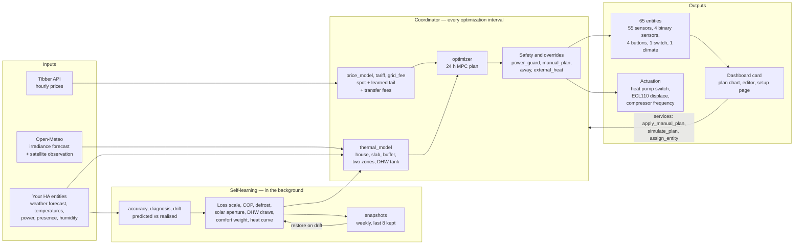

# Architecture

For anyone reading or changing the code. If you want to know what the
integration does rather than how it is built, start with
[how-it-works.md](how-it-works.md).

The shape is a thin Home Assistant layer wrapped around a much larger core that
knows nothing about Home Assistant: 42 modules, of which ten touch the
`homeassistant` package and the rest take numbers in and give numbers back.

## How the pieces fit



## The module map

```text
custom_components/heatpump_optimizer/
├── __init__.py           # Setup and unload, the 11 services, registry migrations
├── const.py              # Every config key, default and tuning constant
├── config_flow.py        # Setup flow plus 13 option pages behind two menus
├── coordinator.py        # The update loop: read, fetch, solve, actuate, learn, publish
├── thermal_model.py      # Two-zone house + slab + buffer + DHW tank physics
├── optimizer.py          # The MPC solve: DHW by LP, space by L-BFGS-B, reason codes
├── open_meteo.py         # Irradiance forecast and satellite observation client
├── inputs.py             # Guarded state reads with a staleness watchdog
│
│   # Prices, tariffs and money
├── price_model.py        # Learned diurnal price shape for the unpublished tail
├── tariff.py             # Monthly capacity (effekt) tariff and peak tracking
├── grid_fee.py           # Time-of-use DSO transfer fees layered on the spot price
├── ledger.py             # Month-keyed ledger of settled energy and money
├── currency.py           # The one place the display currency is decided
├── wear.py               # Compressor start counting and the wear price it implies
│
│   # Weather, sun and hot water
├── pv.py                 # PV production model and marginal-cost pricing
├── defrost.py            # Learned COP and capacity derate in the frosting band
├── dhw_schedule.py       # Demand-window parsing, merging and evaluation
├── dhw_draws.py          # Learned per-window draw quantiles, including heavy days
│
│   # Plumbing and layout
├── mixing_valve.py       # The valve that lets a buffer tank actually store heat
├── topology.py           # One description of the configured system, shared by
│                         #   every picture of it
├── pump_schedule.py      # Hot-water circulation and space pump windows
│
│   # Learning, evidence and self-checks
├── accuracy.py           # Predicted versus realised, recorded per interval
├── diagnosis.py          # One-input-at-a-time attribution of the last interval's error
├── drift.py              # The CUSUM primitive shared by every drift detector
├── snapshots.py          # Weekly learner snapshots and the rollback alarm
├── comfort_learning.py   # Revealed-preference comfort-weight tuning
├── curve_learning.py     # Standing cool-only bias on the ECL110 heat curve
├── sysid.py              # Active step-response identification
├── presets.py            # Building archetypes to thermal parameters
├── external_heat.py      # Wood-furnace detection with hysteresis and decay
│
│   # People, safety and actuation
├── away.py               # Away state, return time and deadline-driven recovery
├── manual_plan.py        # Pinned run slots, and what safety may still release
├── power_guard.py        # Live peak protection inside the metering window
├── freq_control.py       # Inverter frequency: observe first, actuate only on opt-in
├── battery.py            # The thermal stores, published as a virtual battery
├── narrative.py          # The plan told in sentences, grouped by reason
│
│   # Home Assistant entities and frontend
├── sensor.py             # 55 sensors
├── binary_sensor.py      # Input problem, open window, external heat, away mode
├── button.py             # Optimize now, run identification, reset comfort
│                         #   weight, diagnose last interval
├── climate.py            # Virtual climate entity: modes, presets, DHW status
├── switch.py             # Optimizer Active
├── frontend.py           # Serves and registers the Lovelace card
│
├── www/                  # The dashboard card, one self-contained file
├── brand/                # Icon and logo
├── icon.png              # Integration icon
├── services.yaml         # The 11 service definitions
├── strings.json          # UI strings
├── translations/
│   ├── en.json           # English
│   └── sv.json           # Swedish
└── manifest.json         # Integration manifest
```

## The Home Assistant boundary

Exactly ten modules import `homeassistant` at module level: `__init__`,
`config_flow`, `coordinator`, `open_meteo`, `frontend`, and the five entity
platforms `sensor`, `binary_sensor`, `button`, `climate`, `switch`. One module
outside that set touches it at all: `inputs` reaches for `homeassistant.util.dt`
inside a function, as the fallback when no clock function was injected.

Everything else is deliberately free of it, so each module can be driven
directly by `tests/features.py` with no Home Assistant running. That matters
because the failure mode of this integration is a *plausible* plan: a detector
that never fires, or a watchdog that lets a flatline through, produces output
that looks entirely normal. Only a mechanism-level test catches it.

## The three big ones

**`coordinator.py`** is the update loop, and the only module that talks to
almost everything else. Each interval it reads the configured entities through
`inputs`, fetches Tibber prices and the weather forecast, refreshes Open-Meteo
irradiance when that is the selected source, folds any newly complete price day
into the learned price shape, runs the optimization, applies the first step to
the heat pump, and compares last interval's prediction with what actually
happened so the learners have something to learn from. What it publishes is
composed from small per-domain views — thermal, DHW, learning, measurement,
grid, ECL110, external heat, health — rather than one long literal.

**`thermal_model.py`** holds the physics: two zones with their own masses and
losses, the slab, the buffer tank, the mixing valve when one is configured, the
DHW tank with its draws and standby losses, and the COP model with its learned
derates. It is a simulator, not a controller — it answers "if this much power
goes in for this long, where does everything end up".

**`optimizer.py`** does the solve. Hot water is planned first as a deferrable
on/off load, by a linear program plus a cheapest-first repair against the real
tank simulation; space heating is then optimized around those fixed blocks by
multi-start L-BFGS-B; and one co-optimization pass re-plans hot water where the
two competed for the compressor. Comfort bounds are soft penalties rather than
hard constraints, so a cold morning can never be infeasible.

## How a plan is made

```text
prices ─┐
weather ┼─► coordinator._forecast_arrays() ──► ForecastArrays ──► optimizer.optimize()
solar  ─┘        │                                                    │
                 ├─ learned price shape fills the unpublished tail    ├─ with hot water:
                 ├─ PV surplus replaces the import price              │    plan the tank by LP,
                 └─ Open-Meteo overrides irradiance by timestamp      │    then solve space
                                                                      │    around it, then
                                                                      │    re-plan the tank
                                                                      │    against contention
                                                                      └─ without: solve directly
                                                                             │
   entities ◄── coordinator._build_data_dict() ◄── OptimizationResult ◄──────┘
                     │
                     └─ composed from per-domain views (thermal, dhw, learning,
                        measurement, grid, ECL110, external heat, health)
```

Both optimizer paths share one set of cost terms — the comfort penalty, the
terminal cost, the cycling and capacity charges — so enabling hot water cannot
change the space-heating objective. That is not hypothetical tidiness: it used
to, and the two objectives had silently drifted apart.

## Where to start reading

- Changing what the optimizer *wants*: `optimizer.py`, then the cost terms in
  its module docstring.
- Changing what the house *does*: `thermal_model.py`.
- Adding a setting: `const.py` for the key and default, `config_flow.py` for
  the page it belongs on, then wherever it is read.
- Adding an entity: the platform module, plus `translations/en.json` and
  `sv.json` for its name — display names come from the translation key, and
  `tests/entities.py` pins the entity counts the README publishes against the
  entities the platforms actually construct.
