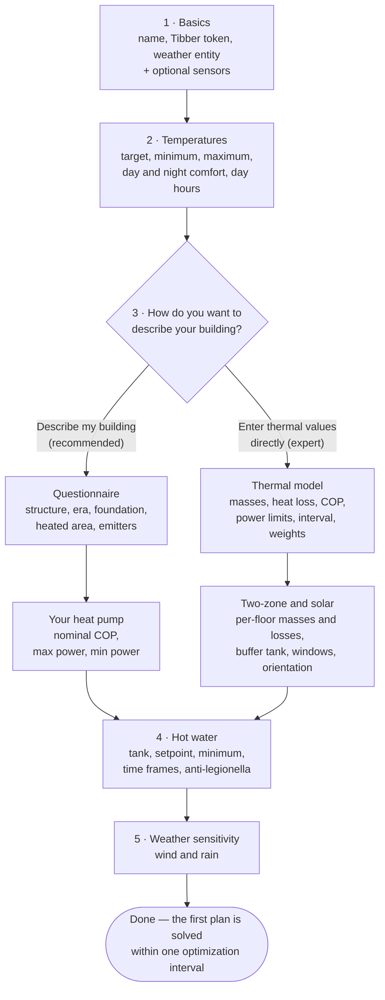

# Configuration reference

Every field the integration asks for: what it means, what it is measured in,
what it defaults to, and when it is worth changing. Nothing here is edited in
YAML — the integration is configured entirely through Home Assistant's UI, and
this page follows the same order the UI does.

- [Initial setup](#initial-setup) — the questions asked once, when you add the integration
- [Changing settings later](#changing-settings-later) — the 13 options pages behind two menus
- [The hydronic layout catalog](#the-hydronic-layout-catalog) — which plumbing arrangements are modelled
- [Services](#services) — every service and its fields

Only two answers are genuinely required: a Tibber API token and a weather
entity. Everything else has a working default. Skipping an optional sensor
costs accuracy, or leaves the one feature that needs it dormant, but it never
stops the integration from planning.

---

## Initial setup

**Settings → Devices & services → Add integration → Heat Pump Optimizer.**

The flow is not a straight line. After the temperatures you choose how the
thermal model gets its starting values, and the two branches ask different
questions:

### 1 · Basics

Where the prices, the forecast and your own measurements come from. The token
is checked against Tibber before the flow continues, and a network failure is
reported as a connection problem rather than as a bad token.

| Setting | Default | What it means |
|---|---|---|
| Name for this integration | Heat Pump Optimizer | Shown in front of every entity this integration creates. |
| Tibber API token | — (**required**) | Reads your hourly electricity prices. Create one at developer.tibber.com. |
| Weather forecast | — (**required**) | A `weather` entity supplying outdoor temperature, wind and rain for the next 24 hours. The optimizer plans ahead, so a forecast is not optional. |
| Indoor temperature sensor | none | The real room temperature. Without it the optimizer trusts its own model, which drifts over time — this is the sensor worth finding first. |
| Outdoor temperature sensor | none | A local thermometer beats the forecast for the current hour. |
| Heat pump on/off switch | none | A `switch` the optimizer may turn off during expensive hours. Without it — and without the ECL110 or frequency-control paths — the plan is published on sensors for your own automations to act on. |
| Solar radiation sensor | none | Irradiance in W/m². Lets the plan skip heating before a sunny afternoon. |
| Solar irradiance source | Weather entity | `Weather entity` reads irradiance from your weather integration, which often does not publish any. `Open-Meteo` fetches a free forecast for the location below; no account needed. |
| Solar irradiance location | your Home Assistant home location | The coordinate Open-Meteo is asked about. Only used when the source is Open-Meteo. |
| Floor heating return temperature sensor | none | Water coming back from the floor loops. Used to gauge how much heat the slab is holding. |
| Lower floor temperature sensor | none | Two-zone houses only. Without it the lower zone is modelled from the main room sensor and labelled as modelled on the plan chart; a repair notice says so. |
| Hot water tank temperature sensor | none | Recommended. Lets a manual hot-water boost reset the anti-legionella timer, and unlocks the learned draw quantiles. Without one, a disinfection cycle the plan commands resets the countdown but is recorded as an *attempt* rather than a verified cycle, and a note in Repairs says the cycle cannot be verified. |
| Buffer tank temperature sensor | none | When set, the tank's cooling rate is learned instead of assumed. |

The Danfoss ECL110 MQTT fields were asked here until v4.1.0. Eight questions
only ECL110 owners can answer do not belong on everyone's first screen, so they
now live on their own options page and default sensibly when absent.

### 2 · Temperatures

The gap between your target and your minimum is what makes savings possible:
the wider it is, the further the house may coast through an expensive hour.

| Setting | Default | Range | What it means |
|---|---|---|---|
| Target indoor temperature | 21.0 °C | 15–28, 0.5 steps | What you actually want. The optimizer aims here and only drifts to avoid expensive hours. |
| Coldest acceptable temperature | 19.0 °C | 14–25 | The coldest the plan will take the house. Priced, not fenced (see [how it works](how-it-works.md#the-objective-term-by-term)), but firm at any real price. |
| Warmest acceptable temperature | 23.0 °C | 18–28 | A limit on pre-heating during cheap hours, never a target. Priced the same way; free solar gain can still carry a room past it. |
| Daytime comfort temperature | 21.0 °C | 16–26 | Preferred temperature during waking hours. |
| Night-time comfort temperature | 19.5 °C | 15–24 | Preferred temperature overnight. A degree or two lower saves money and usually sleeps better. |
| Day starts at | 07 | 00–12 | Hour the daytime temperature takes over. |
| Day ends at | 22 | 18–23 | Hour the night temperature takes over. |

The form refuses four combinations that would leave the plan permanently in
violation: a minimum above the target, a maximum below it, a night temperature
above the day temperature, and a day window that never opens (start at or after
end). The same checks run on the options page later.

### 3 · Your building — two ways to answer

**Describe my building (recommended).** Six questions with answers a homeowner
knows, from which the thermal masses, the heat-loss coefficient and the slab
parameters are derived. These are starting values; the self-learning model
corrects them from how the house actually behaves, so they need not be exact.

| Setting | Default | Choices / range | What it means |
|---|---|---|---|
| What the house is built from | Timber frame on a concrete slab | Timber frame, crawl space or suspended floor · Timber frame on a concrete slab · Concrete or brick on a slab · Stone or masonry | Heavy materials inside the insulation store heat — which is exactly what lets the optimizer buy heat cheaply and spend it later. |
| Roughly when it was built | 1980–2005 | Before 1960 · 1960–1980 · 1980–2005 · After 2005 · Low-energy or passive house | A proxy for insulation standard, and a far better starting point than one global default. |
| Foundation | Slab on ground | Slab on ground · Crawl space · Heated basement | A crawl space adds heat loss; a heated basement adds both loss area and mass. |
| Heated floor area | 140 m² | 20–1000, 5 steps | Everything is scaled by this, so it is the number worth getting closest to right. |
| Upper floor heating | Radiators | Radiators · Floor heating | Radiators respond in minutes, floor heating in hours. This sets how far ahead heat can usefully be shifted. |
| Lower floor heating | Floor heating | Radiators · Floor heating | A heated slab is a large store that gets actively charged, which makes pre-heating both more valuable and more necessary. |

Then three numbers off the heat pump's nameplate:

| Setting | Default | Range | What it means |
|---|---|---|---|
| Heat pump nominal COP | 3.5 | 1.5–6.0, 0.1 steps | Units of heat per unit of electricity under normal conditions. 3 to 4 is typical for air-to-water, 4 to 5 for ground source. |
| Heat pump max power | 5.0 kW | 1–20, 0.5 steps | Electrical input at full output. Caps how much cheap electricity can be stored per hour. |
| Heat pump min power | 1.0 kW | 0–10, 0.5 steps | The lowest input the pump can hold without cycling. Must not exceed the maximum. |

That is the whole questionnaire path — the two-zone and solar pages are skipped
deliberately. Their fields, once written, are what switches the two-zone model
on, and a fresh install should not be given a two-zone model it did not ask
for. If your house does have two independently modelled floors, turn it on
afterwards on **Advanced settings → Thermal model (expert)**.

**Enter thermal values directly (expert)** is for someone holding a real energy
declaration. It asks the model's own numbers:

| Setting | Default | Range | What it means |
|---|---|---|---|
| House thermal mass | 10.0 kWh/°C | 0.5–80, 0.5 steps | Heat stored per degree by the room air, furnishings and light fabric — roughly 0.02 kWh/°C per m² of heated area for timber, 0.05 or more for stone. Heavy floors are counted under the slab mass below, so this is not the whole building. |
| Heat loss coefficient | 0.15 kW/°C | 0.01–1.0, 0.01 steps | Heat lost per degree of indoor-outdoor difference. 0.25 kW/°C across a 20-degree gap means about 5 kW of demand. |
| Slab floor thermal mass | 5.0 kWh/°C | 0.1–60, 0.5 steps | Heat stored per degree by whatever the heat is delivered through: the slab of a floor-heated house — the buffer that lets it be switched off through a price peak — or, with radiators, the water and steel of the radiator circuit, which is far smaller (about 0.2 kWh/°C for 100 m²). |
| Slab-to-room heat transfer | 0.8 kW/°C | 0.02–5.0, 0.1 steps | How fast that store gives its heat to the room. Lower means a sluggish floor that must be charged further in advance; radiators sit far higher. |
| Heat pump nominal COP | 3.5 | 1.5–6.0 | As above. |
| Heat pump max power | 5.0 kW | 1–20 | As above. |
| Heat pump min power | 1.0 kW | 0–10 | As above. |
| Recalculate every | 30 min | 10–120, 5 steps | How often the plan is re-solved against fresh prices and weather. |
| How hard to chase low prices | 1.0 | 0.1–10, 0.1 steps | Higher moves more heating into cheap hours, at the cost of more temperature swing. |
| How strictly to hold the temperature | 5.0 | 0.1–20, 0.1 steps | The counterweight. Around 5 lets the house drift freely inside your allowed range; 10 keeps it noticeably closer to target; 20 or more behaves like an ordinary thermostat. |

followed by the two-zone and solar page:

| Setting | Default | Range | What it means |
|---|---|---|---|
| Upper floor thermal mass | 3.0 kWh/°C | 0.25–60 | Heat stored in the upper zone. Usually much lower than a heated slab, so the zone reacts faster. |
| Lower floor thermal mass | 8.0 kWh/°C | 0.25–60 | Heat stored in the lower zone. |
| Upper floor heat loss | 0.08 kW/°C | 0.001–1.0 | The upper zone's own loss coefficient. |
| Lower floor heat loss | 0.07 kW/°C | 0.001–1.0 | The lower zone's own loss coefficient. |
| Inter-zone heat transfer | 0.5 kW/°C | 0.0–3.0 | How much heat drifts between floors. Higher suits an open stairwell. |
| Share of heat going to radiators | 0.4 | 0.0–1.0, 0.05 steps | 0 sends everything to the slab, 1 everything to the radiators. |
| Upper floor area ratio | 0.5 | 0.1–0.9 | The share of floor area upstairs. 0.5 means two equal floors. |
| Buffer tank size | 35 L | 10–1500, 5 steps | The tank between the pump and the heating circuits. Below 100 L it is modelled but not planned around as a store. |
| Window area facing the sun | 10 m² | 0–50, 0.5 steps | Glazing that gets direct sun, used to predict free solar heat. |
| Solar orientation factor | 0.7 | 0.0–1.0 | How well the glazing faces the sun over a day. 1.0 suits mostly south-facing windows. |
| How much sunlight the windows let through | 0.7 | 0.1–1.0 | The glazing's solar heat gain coefficient. About 0.6 for modern triple glazing. |

Filling in any of the upper mass, lower mass, inter-zone transfer or radiator
share is what turns the two-zone model on. That is why this page is skipped on
the questionnaire path.

### 4 · Hot water

Tell the optimizer when you actually need hot water. It then guarantees a
usable tank temperature during those periods and heats in the cheapest hours
beforehand. Outside them the tank is *meant* to cool — that is where much of
the saving comes from.

| Setting | Default | Range | What it means |
|---|---|---|---|
| Hot water tank size | 200 L | 50–1500, 10 steps | A larger tank stores more cheap electricity and can skip more expensive hours. |
| Highest tank temperature to charge to | 55 °C | 40–65 | An upper limit on charging, not a target. The tank is only filled this high when storing extra cheap heat pays. |
| Hot water temperature you need | 45 °C | 35–55 | Guaranteed inside the time frames below. Must be at least 5 °C below the charge limit, or the plan sits in permanent slight violation. |
| Hot water used per day | 150 L/day | 50–1500 | Roughly your household's daily draw. Used to size what to store before each period. |
| Tank heat loss | 0.3 °C/h | 0.05–3.0, 0.05 steps | Standby cooling at 45 °C in a 20 °C room. A starting point only: the real rate is measured and refined. |
| Only guarantee hot water at set times | on | on/off | Off keeps the tank hot around the clock, which costs noticeably more. |
| When you need hot water | `06:00-08:30, 17:00-22:00` | 24-hour times, comma separated | The tank is heated in the cheapest hours before each period. Leave empty to let the integration learn your habits from actual usage. |
| Let the tank cool to | 20 °C | 10–55 | How cold the tank may get between periods. The default is roughly room temperature — nothing is spent at all. |
| Run an anti-legionella cycle | on | on/off | Because the tank now spends long stretches cool, it is periodically heated hot enough to kill legionella. Strongly recommended. |
| Anti-legionella temperature | 60 °C | 55–70 | The usual recommendation is 60 °C. Check what applies where you live. This applies only while a cycle is running: if it is above the charge limit above, the tank goes above that limit for the cycle and at no other time. |
| Anti-legionella interval | 7 days | 1–30 | Placed in the cheapest hour before each deadline. |

### 5 · Weather sensitivity

| Setting | Default | Range | What it means |
|---|---|---|---|
| Wind sensitivity | 0.03 | 0.0–0.5, 0.01 steps | Extra heat loss per m/s of wind — 0.03 means 3 % more loss per m/s. Raise it if the house noticeably cools on windy days. |
| Rain sensitivity | 1.15 | 1.0–1.5, 0.01 steps | Loss multiplier while it is raining. 1.0 means rain makes no difference. |

Saving this page creates the entry. All 65 entities appear at once and the
first plan is solved within one optimization interval.

---

## Changing settings later

**Settings → Devices & services → Heat Pump Optimizer → Configure.**

There are **13 pages**: six on the first menu, and seven more behind
**Advanced settings**. One of the six — *Your system, as configured* — is
read-only. Each page saves on its own, so changing one setting never touches
another page's values.

| First menu | What lives there |
|---|---|
| Your system, as configured | A read-only picture of your setup, drawn from the same description the card's setup tab uses |
| Comfort and temperatures | The temperature band, the heating day, and the mold guard |
| Hot water | Time frames, tank, anti-legionella, inlet water, circulation pumps |
| Savings vs comfort | The weights, the interval, and what a compressor start costs |
| Grid costs | Capacity tariff, transfer fees, main fuse, live guards |
| Away and holiday mode | Setback while the house is empty, and timed recovery |

| Advanced settings | What lives there |
|---|---|
| Sensors and entities | Every entity the optimizer reads, and frequency control |
| Heating system and heat storage | Mixing valve, buffer tank, wood furnace tank |
| Building type and emitters | The questionnaire again, plus windows and weather sensitivity |
| Thermal model (expert) | The raw model numbers and the two-zone switch |
| Solar panels | Array size, efficiency, export compensation |
| Self-learning and diagnostics | The watchdogs and every opt-in learner |
| Heat curve control (ECL110) | MQTT topics and displace limits |

### Your system, as configured

No fields. It renders what the optimizer believes your system is: the zones,
the tanks, the valve, and every sensor slot with what is assigned to it. Empty
slots are shown as empty on purpose — the point is to reveal what is missing.

### Comfort and temperatures

The seven temperature fields are exactly those from setup step 2, with the same
defaults, ranges and cross-checks. Three more live here:

| Setting | Default | Range | What it means |
|---|---|---|---|
| Keep cold surfaces below mold humidity | off | on/off | The coldest spot in the house sits well below room temperature, and mold starts where its surface humidity stays above 80 %. With this on, the plan will not coast below the temperature that keeps that spot safe. It never heats past your comfort target. |
| Indoor humidity sensor | none | a `humidity` sensor | Required for the guard: without a live reading it stays off regardless of the switch. |
| Worst thermal bridge factor (fRsi) | 0.75 | 0.3–0.98, 0.01 steps | How cold your worst surface gets: surface = outdoor + fRsi × (room − outdoor). 0.75 is the Swedish building-code guidance; lower means a colder spot and a more cautious guard. |

### Hot water

The eleven fields from setup step 4 reappear here unchanged. Twelve more
refine the model and add hardware:

| Setting | Default | Range | What it means |
|---|---|---|---|
| Cold water inlet temperature | 10.0 °C | 2–25, 0.5 steps | Yearly average temperature of the water refilling the tank. Change it only if you have measured yours. |
| Seasonal inlet swing | 0.0 °C | 0–8, 0.5 steps | How far the incoming water swings around that average over the year. 0 treats it as constant. |
| Cold water inlet sensor | none | a temperature sensor | When set, its live reading replaces the model above. |
| Greywater heat recovery effectiveness | 0.0 | 0–0.9, 0.05 steps | The fraction of drain heat a drain-water recovery unit returns. 0 means none installed. |
| Learn heavy-day hot water targets | off | on/off | Makes the tank ready for a heavy day rather than an average one. Needs a tank sensor, configured time frames, and a couple of weeks of evidence. |
| Credit disinfection from any heat source | off | on/off | If a wood boiler, solar coil or immersion heater already got the tank hot enough and held it there, count that as a completed cycle. |
| Let the anti-legionella cycle pick a cheap day | off | on/off | Allows the cycle to run a day or two early when electricity is unusually cheap. The deadline is still always honoured. |
| Earliest anti-legionella re-run | 5 days | 1–14 | A floor on how close together cycles may run, however cheap the day. |
| Shower flow rate | 8.0 L/min | 4–20, 0.5 steps | Only used to translate the tank's contents into shower minutes on the Mixed Hot Water sensor. |
| Hot water circulation pump switch | none | `switch` / `input_boolean` | When set, the circulation loop pump runs only during your hot water time frames plus the lead time below. |
| Start circulation before a time frame | 20 min | 0–120, 5 steps | So the loop is already hot when the time frame opens. |
| Heating circulation pump switch | none | `switch` / `input_boolean` | Paused only in slots that are provably idle and warm — it always runs when heat is planned, when it is freezing outside, or when any room is near its comfort floor. |

### Savings vs comfort

The trade-off between a cheap bill and a rock-steady temperature. If the house
feels cool during price peaks, raise **How strictly to hold the temperature**
or raise your minimum temperature; both work, and both trade savings for
warmth.

| Setting | Default | Range | What it means |
|---|---|---|---|
| How hard to chase low prices | 1.0 | 0.1–10 | Higher moves more heating into cheap hours and allows more swing. |
| How strictly to hold the temperature | 5.0 | 0.1–20 | The most effective knob you have. It is weighed against the range you allow, so widening that range makes the optimizer bolder. |
| Recalculate every | 30 min | 10–120, 5 steps | More often reacts quicker and does more work. |
| Cost of one compressor start | 0.0 | 0–10, 0.05 steps | In the same currency as your prices. Discourages plans that switch on and off repeatedly. The **Compressor Starts** sensor counts *realised* starts and needs a power meter; the plan's own projected start count is not published on any entity. |
| Caution with guessed prices | 0.0 | 0.0–2.0, 0.05 steps | Beyond the published horizon prices come from your learned daily shape. This adds a premium proportional to how wrong those guesses have tended to be. 0 trusts them at face value. |
| Hold a safety margin where the model is unsure | off | on/off | Raises the comfort floor by the model's own expected error at that horizon, capped at 0.8 °C and shrinking as accuracy improves. |
| Compressor replacement cost | 0 | 0–100 000, 100 steps | What a compressor swap costs including labour, in your price currency. Divided by the rated starts below it prices each realised start. 0 keeps the start counter pure observation. |
| Compressor rated starts | 100 000 | 1 000–1 000 000 | What the manufacturer rates the compressor for. |
| Let realised wear tune the cycling cost | off | on/off | Makes the wear price a floor under the cycling cost above. The only insight feature that changes plans. |
| Refresh price tiles after each solve | off | on/off | Prices one what-if tile after each scheduled optimization — one degree lower, one higher, power capped at 75 %, in rotation. Off by default because each tile is a full extra solve. |

### Grid costs

Costs that are not simply the price per kWh. Many grid companies bill a monthly
capacity charge on your highest hours, which means stacking hot water and space
heating into the same cheap hour can cost more than it saves.

| Setting | Default | Range | What it means |
|---|---|---|---|
| My grid bill has a capacity charge | off | on/off | Adds the monthly power-peak fee to the objective, so flattening peaks is worth actual money. |
| Capacity charge per kW per month | 45 | 0–500 | Take it from your grid invoice; it varies a lot between companies. |
| Number of peak hours averaged | 3 | 1–10 | Most Swedish tariffs average the three highest hours of the month. |
| Measurement window | 1 hour | 15 minutes / 1 hour | Some newer tariffs measure every 15 minutes, which is much less forgiving. |
| Months the capacity tariff applies | empty | e.g. `Nov-Mar` | Empty means every month. Outside these months a peak contributes nothing, and the plan knows it. |
| Peak hours | empty | e.g. `07:00-19:00` | Empty means every hour counts in full. Outside these hours a peak counts at the factor below. |
| Weekends are off-peak | off | on/off | Many tariffs only bill weekday peaks. |
| What off-peak hours count at | 1.0 | 0.0–1.0, 0.05 steps | 1.0 treats every hour alike. 0.5 is the common half-rate night; 0 makes off-peak peaks free. |
| Main fuse size | 0 A | 0–125 | From your grid contract. **0 means unconfigured**, which keeps the fuse advisor, the fuse guard and the headroom sensor dormant — there is no safe default to guess. |
| Phases | 3 | 1–3 | Nearly every Swedish house is 3-phase. |
| Keep the plan under the main fuse | off | on/off | Caps planned power at what the fuse leaves after the rest of the house. If a cap would make the comfort floor unreachable, the plan says so instead of silently going cold. |
| Live peak guard | off | on/off | Watches the power meter and, when the current metering window is projected to set a new billed peak, holds back electric hot water and nudges the heat curve down for the rest of that window. Needs a power meter. |
| Peak guard margin | 0.5 kW | 0.0–3.0, 0.1 steps | How far below the billed threshold the guard starts acting. Larger catches more peaks and intervenes more often. |
| Grid transfer fee | None | None / Time-of-use rules / Live sensor | The fee your grid company adds per kWh. Spot prices do not include it, so with it configured the plan finally sees the whole marginal price. |
| Fixed transfer fee | 0.0 per kWh | 0–5, 0.01 steps | A flat fee added in every hour, on top of any rules. |
| Time-of-use fee rules | empty | one rule per line | For example `Nov-Mar Mon-Fri 06:00-22:00 = 0.25`. Month, weekday and time parts are each optional; overlapping rules add together. |
| Live fee sensor | none | a sensor | For grids with dynamic fees. Its value is added to every planned hour. |
| Fixed contract price to compare | 0.0 per kWh | 0–10, 0.01 steps | If you could have a fixed-price contract, its price per kWh. The Contract Comparison sensor then shows what this month would have cost on it. 0 leaves that column out. |

Fee amounts are in the same currency as your electricity prices; some labels
still read SEK, which is the historical default rather than a constraint.

### Away and holiday mode

A week away is the biggest single saving a heating system can offer. Tell it
when you are coming back and the re-heat is bought in the cheapest hours
beforehand instead of at whatever the price is when you walk in.

| Setting | Default | Range | What it means |
|---|---|---|---|
| Enable away mode | off | on/off | Deep setback while the house is empty, with recovery timed to your return. |
| Away indicator | none | `input_boolean`, `person`, `device_tracker`, `calendar`, `binary_sensor` | Polarity is handled for you: a person being *not home* and a holiday toggle being *on* both mean away. |
| Expected return time | none | `input_datetime` or a sensor | Without it the house stays at the setback until you switch back manually. |
| Temperature while away | 16.0 °C | 5–21, 0.5 steps | Low enough to save, high enough to protect the house and its plumbing. |
| Hot water minimum while away | 20.0 °C | 10–55 | The anti-legionella cycle still runs, timed to finish before you get back. |

### Sensors and entities

Everything the optimizer reads — eighteen fields in all. Clearing a field
genuinely clears it. Twelve of them are the same fields offered during setup
step 1, with the same meanings; the remaining six are the meters and the
compressor-frequency path.

| Setting | Default | Range | What it means |
|---|---|---|---|
| Tibber API token | from setup | required | Re-validated against Tibber whenever you change it. |
| Weather forecast | from setup | required | The forecast source. |
| Indoor / outdoor temperature | from setup | temperature sensors | See setup step 1. |
| Solar radiation sensor, source, location | from setup | — | See setup step 1. |
| Hot water tank, buffer tank, floor return, lower floor sensors | from setup | temperature sensors | See setup step 1. |
| Heat pump on/off switch | from setup | a `switch` | See setup step 1. |
| Heat pump power meter | none | a `power` sensor | Actual electrical draw. With it, efficiency becomes measurable, predicted cost gets a real counterpart, and a wood fire is detected reliably. Several sensors stay unavailable without it. |
| Heat pump energy meter | none | an `energy` sensor | A cumulative kWh meter is more accurate than adding up power readings, which misses short runs. |
| Whole-house power meter | none | a `power` sensor | A capacity tariff is billed on the whole house, so without this the peak being avoided is only part of the real one. |
| Compressor frequency entity | none | a `number` entity | Typically from Modbus or ESPHome. With it the optimizer learns a kW-per-Hz map and recommends a frequency. |
| Actual frequency sensor | none | a `frequency` sensor | Many number entities are setpoint registers that echo the last written value. Read from an echo, the watchdog can never see divergence. Leave empty only if the number entity genuinely tracks the machine. |
| Frequency mode | Observe | Observe / Control | Observe learns and recommends but never writes. Switch to Control only after validating the entity against your hardware: writes go through `number.set_value`, at most one per five minutes, clamped to the entity's own range, and three ticks of divergence stand the controller back down to Observe. |

### Heating system and heat storage

Everything between the heat sources and the emitters. Leave the valve at *No
mixing valve* if you do not have one — the model is already correct for that
case.

| Setting | Default | Range | What it means |
|---|---|---|---|
| Mixing valve | No mixing valve | No mixing valve · Set by hand · Read from a sensor · Commanded by the optimizer | *Set by hand* is a valve you set yourself and tell the integration about. *Read from a sensor* means it can see the target but not change it. *Commanded* writes the recommended target through the control entity below. |
| Valve target temperature | 0 °C | 0–30, 0.5 steps | The indoor temperature the valve holds. **0 means "use the top of your comfort band"**, which is the recommended setting: the building charges first at no efficiency cost, and the tank takes only the surplus. |
| Valve target sensor | none | a temperature sensor | Reads the valve's target instead of using the fixed value above. |
| Valve control entity | none | `number`, `input_number` or `climate` | Required for *Commanded by the optimizer*. Written after each planning cycle, and only when the answer changes. |
| Buffer tank size | 35 L | 10–1500, 5 steps | The tank between pump and circuits. It is only planned around as a store when a throttling valve exists and the volume is at least 100 L; below that it holds less than one optimizer step of heat. |
| Maximum buffer tank temperature | 70 °C | 40–90 | A hard ceiling. The tank is never charged above this, however cheap electricity is. |
| Temperature after the wood/heat-pump mixing valve | none | a sensor | With the tank sensors, this says how much of the heating a fire is covering right now, so electric heat can stand down by that much instead of all-or-nothing. |
| Wood tank top sensor | none | a sensor | **The switch for the two-tank model.** Together with the bottom sensor it says how much a fire has left: a hot top over a cold bottom means the charge is nearly spent. |
| Wood tank bottom sensor | none | a sensor | Both are needed for the remaining-energy estimate; one alone is read conservatively. |
| Wood tank volume | 500 L | 50–3000, 50 steps | Bounds how much free heat a fire can still deliver. |
| Hot water refilled through the wood tank | off | on/off | The hot water tank's cold inlet passes through a coil in the wood tank, so refill water arrives preheated. Only takes effect when the wood tank is modelled as its own store. |

### Building type and emitters

The same six questions as the setup questionnaire, plus the structural
properties the preset does not derive — so a hand-set window area survives
turning the preset on.

| Setting | Default | Range | What it means |
|---|---|---|---|
| Derive thermal values from the building type | off | on/off | While this is on, **every save of this page** recalculates the ten derived values on *Thermal model (expert)* from your answers below and overwrites whatever is there. It never runs at any other time. Changing one of those values to a different number on the expert page switches this back off, so your own number stays; re-saving the expert page unchanged does not. |
| The six questionnaire fields | as setup | see setup step 3 | Identical questions and choices; one field list serves both flows. |
| Window area facing the sun | 10 m² | 0–50, 0.5 steps | Glazing that gets direct sun. Not derived by the preset. |
| How much sunlight the windows let through | 0.7 | 0.1–1.0 | The glazing's solar heat gain coefficient. |
| Wind sensitivity | 0.03 | 0.0–0.5 | As setup step 5. |
| Rain sensitivity | 1.15 | 1.0–1.5 | As setup step 5. |

### Thermal model (expert)

The raw numbers, otherwise only asked at setup. **A field left empty keeps its
current value and is never saved** — that is what lets a single-zone house stay
single-zone, and filling in the zone fields is how an existing install turns
the two-zone model on.

The seven core fields, and the eight per-zone and solar-orientation fields, are
the ones from the expert setup pages above with the same ranges. Buffer tank
size lives on *Heating system and heat storage*; window area and the glazing
coefficient live on *Building type and emitters*. One field exists only here:

| Setting | Default | Range | What it means |
|---|---|---|---|
| Two-zone model | Automatic | Automatic · On · Off | *Automatic* means two-zone as soon as any zone value has ever been saved — which can only ever turn it on. **Off is the only way back to single-zone**, because values written during setup live where the options flow cannot erase them. *On* forces two-zone using the values below or their defaults. |

Two things about this page that follow from where its numbers come from.

**Changing a derived value turns the derivation off.** Ten of these fields are
what *Building type and emitters* works out from the questionnaire. If that
switch stayed on, the next save of that page would take your edit back — so
changing any of the ten to a different value switches it off instead, and the
page says so while it is still armed. Only a real change counts: pressing
Submit without touching anything, re-typing a value that was already there, or
editing one of the fields the questionnaire does not own all leave it on.

**A stored value outside a field's normal range widens that field rather than
blocking the page.** The ranges cover the physics of a 40–400 m² building; a
20 m² cabin or a 1000 m² block can derive something outside them, and the
`apply_schedule` service and the thermostat can store comfort values outside
theirs. The one field holding such a value stretches to show it and is flagged
with a warning, so the value can be seen, kept, or corrected; every other field
keeps its normal limits. Before v5.1.6 the page simply refused to save, with no
message.

### Solar panels

If you have solar, heating hot water or the buffer from surplus beats exporting
it at the compensation rate. Told about the array, the plan prices each hour at
what consuming actually costs you.

| Setting | Default | Range | What it means |
|---|---|---|---|
| I have solar panels | off | on/off | Lets the plan run the heat pump on your own surplus instead of selling it for less than bought power costs. |
| Installed capacity | 0.0 kWp | 0–100, 0.1 steps | The array's rated peak, used to scale the production forecast. |
| Overall system efficiency | 0.80 | 0.3–1.0, 0.01 steps | Everything between sunlight and the meter: inverter losses, panel temperature, dirt, orientation. |
| Export compensation per kWh | 0.0 | 0–10, 0.01 steps | What you are paid for an exported kWh. While you have surplus, that is what an extra kWh of heating really costs. |
| Export compensation entity | none | a sensor | Use this instead if your compensation follows the spot price. |
| Solar production sensor | none | a `power` sensor | Lets the forecast correct itself against what the roof actually delivers. |

### Self-learning and diagnostics

The sensor watchdog is on by default and protects everything else. The rest are
off until you turn them on; each one changes either what is learned or what is
planned, and the descriptions say which.

| Setting | Default | Range | What it means |
|---|---|---|---|
| Ignore sensors that stop updating | on | on/off | A dead battery leaves a normal-looking value in place forever. With this on, an old value is treated as missing and learning pauses instead of learning the flatline. |
| Allow this much extra age | 1.0 | 0.5–10.0, 0.5 steps | Raise it if sensors that deliberately report rarely are being flagged. |
| Detect a wood furnace or other heat source | off | on/off | Spots the tanks warming while the pump is idle and holds back planned electric hot water. |
| Stove or flue sensor | none | `binary_sensor`, `switch`, `input_boolean`, `sensor` | Trusted over the automatic detection. |
| Temperature rise that counts as evidence | 1.5 °C/h | 0.5–10, 0.1 steps | Raise it if normal operation triggers it. Missing a fire costs one unnecessary cycle; wrongly assuming one can leave you without hot water. |
| How long to keep assuming it after it stops | 90 min | 15–360, 15 steps | Longer holds the plan back further after a fire burns down. |
| Learn my comfort preference from overrides | off | on/off | Every temperature override says the plan went too far one way. This adjusts the comfort weight from that, shows the result on its own sensor, and has a reset button. |
| Allow a one-off measurement experiment | off | on/off | Lets the optimizer run a small deliberate heating step on a mild, cheap night to measure your house directly instead of inferring it over weeks. Kept too small to notice, and stopped if the temperature drifts. |
| Estimate prices past the published horizon | on | on/off | Tomorrow's prices arrive around 13:00. Until then this uses your learned daily price shape instead of a flat repeat, and the plan marks which hours are estimated. |
| Staggered recovery after a power cut | off | on/off | After an outage everything restarts at once, which is exactly when a new monthly peak gets set. This opens a two-hour recovery window where hot water queues 45 minutes behind space heating unless the tank is genuinely low. |
| Ease heating while a window is open | off | on/off | The detector always pauses learning; this additionally lowers the target by 1 °C while a window appears open. Off by default because it moves real heat. |
| Plan around immersion heater use | off | on/off | Repeated immersion use raises the hot-water planning margin so the heat pump gets there first, with the extra cost shown as its own line in the ledger. |
| Tell snow from rain in the forecast | off | on/off | Rain soaks the envelope and raises heat loss; snow does not. Needs the Open-Meteo connection. |
| Assume less sun after heavy snowfall | off | on/off | Halves modelled solar gain for two days after heavy snowfall. Deliberately crude. |
| Plan within measured heat pump capacity | off | on/off | Learns how much heat the pump has actually delivered at each outdoor temperature. It can only trim optimism — at least 60 % of nameplate always stays available. |
| Learn how much sun the windows really admit | off | on/off | Scales solar gain against sunny-hour prediction errors, clamped between 0.3× and 2× the configured value. |
| Learn the household's daily heat rhythm | off | on/off | Learns a per-hour internal-gains profile from dark-hour prediction errors, tethered to the configured value. |
| Learn a correction to the heat curve | off | on/off | Learns a standing correction from days that held comfort with room to spare — at most half a degree per week, snapping back to the installer's curve on any comfort miss. It can only cool an over-hot curve, never heat. |

### Heat curve control (ECL110)

For Danfoss ECL110 controllers driven over MQTT. Leave blank if you do not have
one; see [ecl110.md](ecl110.md) for the full picture.

| Setting | Default | Range | What it means |
|---|---|---|---|
| Offset command topic | `ecl110/flow_temp_control/displace/set` | MQTT topic | Where the parallel heat-curve offset is published. |
| Legacy JSON command topic | `ecl110/command` | MQTT topic | Only for older setups expecting a JSON payload. |
| Status topic | `ecl110/flow_temp_control/displace` | MQTT topic | Where the controller reports its state. |
| MQTT quality of service | 1 | 0–2 | 0 is fine for almost everyone. |
| Retain MQTT messages | off | on/off | Keeps the last offset on the broker so the controller picks it up after a restart. |
| Largest downward offset | −20 °C | −30–0, 0.5 steps | How far the curve may be shifted down during expensive hours. |
| Largest upward offset | 20 °C | 0–30, 0.5 steps | How far it may be shifted up when storing cheap heat. |
| Controller response time | 1.5 h | 0.25–6.0, 0.25 steps | Roughly how long the controller takes to act on a new offset, so the optimizer does not ask for changes faster than the system can follow. |

---

## The hydronic layout catalog

The optimizer models a named arrangement of pipes, not a free-form drawing. A
layout is only ever stored as a catalog key, and only when your configuration
can actually honour it — so the picture on the card's setup tab, the physics in
the model and the settings on the pages above can never drift apart.

Most people never touch this. The layout is derived from what you configured:

- no throttling mixing valve → **No mixing valve**;
- a throttling valve, two zones **and** a wood tank top sensor → **Two tanks, one 4-way valve**;
- any other throttling valve → **One tank behind a valve**.

The layout editor on the card's Setup tab is where you override that, and
*Valve on the radiators, slab fed direct* is only reachable that way — nothing
derives it. If the configuration later stops supporting your stored choice —
the valve mode changed, the probe was removed — the derived default quietly
takes over again rather than erroring.

```mermaid
flowchart TB
    subgraph L1["No mixing valve (no_valve)"]
        direction LR
        hp1["Heat pump"] --> t1["Buffer tank<br/>(pass-through)"] --> z1["Emitters"]
    end
    subgraph L2["One tank behind a valve (single_tank_valve)"]
        direction LR
        hp2["Heat pump"] --> t2["Buffer tank"] --> v2["Mixing valve"] --> z2["All circuits"]
    end
    subgraph L3["Two tanks, one 4-way valve (two_tank_4way)"]
        direction LR
        hp3["Heat pump"] --> t3["Heat pump tank"]
        w3["Wood tank<br/>(drawn wood-first)"] --> v3["4-way valve"]
        t3 --> v3
        v3 --> u3["Upper floor"]
        v3 --> lo3["Lower floor"]
    end
    subgraph L4["Valve on the radiators, slab fed direct (valve_upper_direct_slab)"]
        direction LR
        hp4["Heat pump"] --> t4["Buffer tank"]
        t4 --> v4["Mixing valve"] --> r4["Radiators"]
        t4 --> s4["Slab<br/>(raw tank water)"]
    end
```

On every layout the heat pump also feeds the hot water tank directly whenever
hot water is modelled; that pipe is left out above to keep the sketches
readable. On a single-tank layout a wood tank, if you have one, is drawn
feeding the buffer tank — its heat is folded in rather than stored separately.

| Layout | What it is | Requires | Selectable |
|---|---|---|---|
| No mixing valve | Everything the pump makes reaches the emitters; the tank is a pass-through with a standing loss | no throttling mixing valve | yes |
| One tank behind a valve | The valve regulates one shared flow to every circuit; wood heat, if any, is folded into the heat-pump tank | a throttling mixing valve | yes |
| Two tanks, one 4-way valve | A wood tank beside the heat-pump tank; the valve draws wood-first while usable and feeds both floors in parallel. With the DHW coil option, the hot water tank is drawn off the wood tank too | a throttling valve, two zones and a wood-tank top probe | yes |
| Valve on the radiators, slab fed direct | Only the radiator circuit sits behind the valve; the slab drinks raw tank water | a throttling valve, two zones, and no wood-tank probe | yes |
| Separate slab shunt | A second shunt on the slab circuit | — | **no** — recorded as a known layout, not selectable until physics exists for it |

---

## Services

Eleven services are registered under the `heatpump_optimizer` domain. The seven
that act on a specific config entry also accept an optional `entry_id`; omitting
it applies the call to every loaded entry, which is what a single-heat-pump
install wants. Of those seven, only `assign_entity`, `apply_topology` and
`apply_schedule` write configuration back into the entry — the other four act on
the running coordinator. `run_optimization`, `set_mode`, `set_thermal_parameters`
and `simulate_plan` always act on every loaded entry.

| Service | Fields | Returns |
|---|---|---|
| `run_optimization` | none | — |
| `set_mode` | `mode` (required) | — |
| `set_thermal_parameters` | 28 optional model fields | — |
| `simulate_plan` | 11 optional comfort fields | always |
| `apply_schedule` | 5 optional schedule fields + `entry_id` | optional |
| `assign_entity` | `key`, `entity_id` (both required) + `entry_id` | optional |
| `apply_topology` | `layout` (required), `positions`, `entry_id` | optional |
| `apply_manual_plan` | `space_slots`, `dhw_slots`, `expires_at`, `entry_id` | optional |
| `clear_manual_plan` | `entry_id` | optional |
| `restore_learned_snapshot` | `entry_id` | optional |
| `diagnose_interval` | `entry_id` | optional |

**`run_optimization`** fetches prices and weather and re-solves the 24-hour plan
immediately. The **Optimize Now** button does the same thing.

**`set_mode`** takes `mode`: `auto` (full optimization), `comfort` (hold the
comfort temperature and ignore prices), `economy` (allow up to 1.5 °C below your
comfort floor to ride out expensive hours, never below 15 °C), `boost` (maximum
heating power) or `off`.

**`set_thermal_parameters`** writes model parameters at runtime. All 28 fields
are optional and anything omitted is left alone. The ranges below are the
physics bounds rather than the UI's convenience sliders, so several are wider
than the options pages allow — an automation calling with a zero thermal mass
would otherwise divide by zero inside the model:

- **House and slab:** `house_thermal_mass` and `slab_thermal_mass` (each
  0.01–200), `house_heat_loss_coefficient` (0.01–10), `slab_heat_transfer`
  (0.01–50).
- **Heat pump:** `heat_pump_cop_nominal` (1.0–8.0).
- **Two zones:** `upper_floor_thermal_mass`, `lower_floor_thermal_mass`
  (0.01–200), `inter_zone_heat_transfer` (0.01–50), `radiator_power_fraction`
  (0–1).
- **Solar:** `window_area` (0.01–500), `solar_heat_gain_coefficient` (0–1).
- **Hot water:** `dhw_tank_volume` (0.01–2000), `dhw_setpoint` (30–75),
  `dhw_min_temperature` (10–70), `dhw_daily_consumption` (0.01–2000),
  `dhw_cooling_rate` (0.01–5), `buffer_cooling_rate` (0.01–50),
  `dhw_schedule_enabled`, `dhw_windows`, `dhw_idle_min_temperature` (5–60),
  `dhw_legionella_enabled`, `dhw_legionella_temperature` (55–75),
  `dhw_legionella_interval_days` (0.01–60).
- **Weather:** `wind_sensitivity_factor` (0–1),
  `rain_heat_loss_multiplier` (1–2).
- **ECL110:** `ecl110_pid_time_constant_hours` (0.01–24),
  `ecl110_displace_min` (−30–0), `ecl110_displace_max` (0–30).

**`simulate_plan`** prices a hypothetical comfort choice against the current
forecast without disturbing operation, and returns the answer directly. Fields,
all optional: `target_temp`, `min_temp`, `max_temp`, `comfort_weight`,
`comfort_temp_day`, `comfort_temp_night`, `dhw_setpoint`,
`dhw_min_temperature`, `day_start_hour` (0–23), `day_end_hour` (0–24),
`dhw_windows`. An empty `dhw_windows` string is meaningful: it simulates having
no guaranteed hot water periods at all. The underlying solve is rate-limited,
so dragging a slider cannot trigger one solve per pixel — this is what the
card's what-if panel calls.

**`apply_schedule`** is the save counterpart: it writes `day_start_hour`,
`day_end_hour`, `comfort_temp_day`, `dhw_min_temperature` and `dhw_windows`
into your configuration and reloads the entry, so the next plan uses them. The
windows are parsed and canonicalised before storing, and a day window that
would never open is rejected — checked against the values that *would* be
stored, not only against the ones in the call.

**`assign_entity`** assigns or clears one optional sensor slot: `key` is one of
the 17 assignable configuration keys (`outdoor_temp_entity`,
`solar_radiation_entity`, `pv_production_entity`, `indoor_temp_entity`,
`lower_floor_temp_entity`, `floor_return_temp_entity`,
`heat_pump_switch_entity`, `heat_pump_power_entity`, `heat_pump_energy_entity`,
`house_power_entity`, `buffer_tank_temp_entity`, `mixing_valve_target_entity`,
`dhw_temp_entity`, `external_heat_entity`, `wood_tank_top_entity`,
`wood_tank_bottom_entity`, `valve_outlet_temp_entity`) and `entity_id` is the
entity to put there — an empty string clears the slot. The entity must exist
and its domain must be one the slot accepts. This is what clicking a sensor on
the card's Setup tab calls; it writes exactly what the options pages write.

**`apply_topology`** stores the hydronic layout the setup editor snapped to:
`layout` is one of the four selectable catalog keys above, and `positions` is an
optional `{place: [x, y]}` map of cosmetic box coordinates. Free-form edge sets
are never stored — the editor matches a drawing against the catalog and saves
only the key.

**`apply_manual_plan`** pins exact run slots. `space_slots` and `dhw_slots` are
lists of `{start, end}` ISO datetimes; an empty list means *forced off* for that
channel, and omitting one leaves it automatic. `expires_at` defaults to 20 hours
from now and must be in the future. Slots are validated in full before any
coordinator is touched, so a rejected call leaves an existing pin untouched.
Safety still wins: a forced-off slot is released if the house or the tank would
breach a hard floor, and the legionella clock is never skipped.

**`clear_manual_plan`** drops the pins immediately.
**`restore_learned_snapshot`** rolls every learner back to the last healthy
weekly snapshot — the manual counterpart of the drift watchdog.
**`diagnose_interval`** attributes the last interval's temperature error
input by input and publishes the result on the Prediction Accuracy sensor.

---

## Where else to look

- [../README.md](../README.md) — what the integration does, the entity list, and the first 30 minutes
- [how-it-works.md](how-it-works.md) — the mechanisms behind these settings
- [dashboard-card.md](dashboard-card.md) — the card, its own configuration keys, and the Setup tab
- [ecl110.md](ecl110.md) — the Danfoss ECL110 path in full
