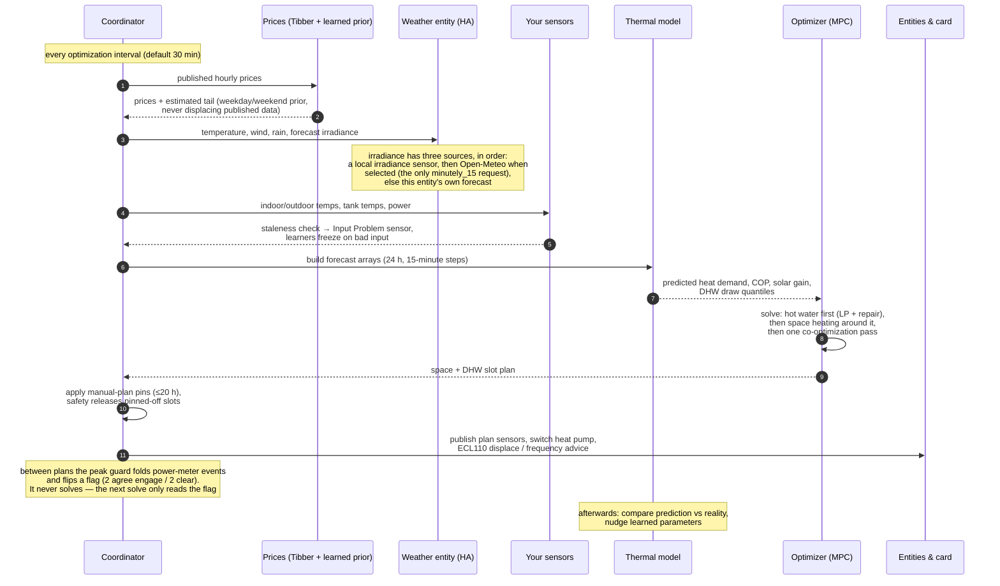
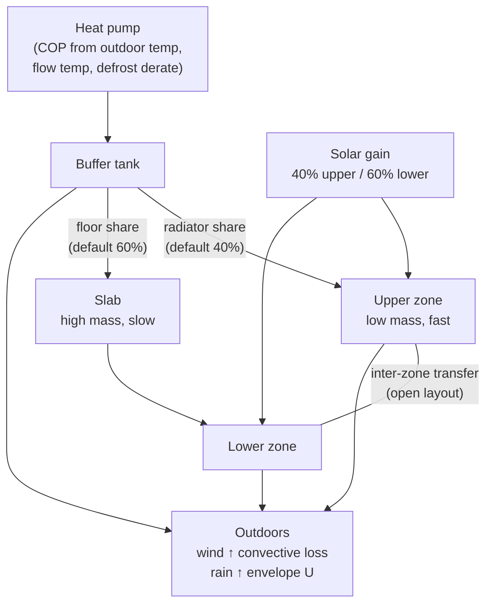

# How it works

This is the long version. If you only want to know what the integration does
and how to set it up, stay in the [README](../README.md) — it has a one-page
summary of the same loop. This document is for when a plan surprised you and
you want to know why, or when you are deciding whether a setting is worth
turning on.

Everything below describes the code in this repository. Where a number is a
default, it is the default the code ships; where a figure came from a
measurement, it says so.

---

## What the optimizer is actually solving

A heat pump has one job — keep the house at a temperature you like — and
almost no freedom in *when* it does it, because most controllers only react to
the room they are standing in. But a house is a thermal store. Heat bought at
02:00 is still largely there at 08:00, and electricity at 02:00 can cost a
fraction of what it costs at 08:00. The same is true of a hot water tank, only
more so: nobody notices what time the water was heated.

So the question the optimizer answers is not "should the pump run now" but:

> Given the prices I can see, the weather I expect, and what I know about how
> this particular house holds heat — what is the cheapest schedule for the next
> 24 hours that still keeps every room inside its comfort band and hot water
> available when it is wanted?

That is a *model predictive control* (MPC) problem, and it needs three things
to be right: a **forecast** (prices, temperature, wind, rain, sun), a **model**
of how this house turns electricity into indoor temperature and loses it again,
and an **objective** that says what "best" means — including what a degree of
discomfort is worth in money.

The model is the part nobody can hand you. A datasheet describes a house that
does not exist; yours has its own leakage, its own solar aperture, its own
occupancy heat. So the model is *learned*, continuously, from the difference
between what it predicted and what actually happened — and most of the
engineering here is about learning it safely.

---

## The planning cycle

Every optimization interval (30 minutes by default), the coordinator gathers
inputs, builds a 24-hour horizon on a 15-minute grid, solves it, and publishes
the result. Only the first step is ever acted on: the rest is re-solved next
interval against fresher data. That is what makes an imperfect forecast
survivable — a wrong guess about hour 20 is corrected forty times before hour
20 arrives.



**Why hot water is solved first.** The two circuits share one compressor but
are very different problems. Space heating is continuous with a smooth
objective, so a gradient solver handles it well. Hot water is an on/off block
load with hard deadlines, which a gradient solver smears into a trickle the
hardware cannot deliver. So hot water is planned first — a linear program plus
repair passes against the real tank simulation — and space heating is then
optimized around the fixed DHW blocks by multi-start L-BFGS-B.

Solving them in sequence would let hot water fill the cheapest hours to the
compressor ceiling and push space heating into dearer ones. Two things prevent
that:

- **A congestion premium** inside the DHW program. Taking compressor capacity
  in a step where space heating also wants it is charged the extra price of
  buying the displaced space heating elsewhere, using the cheapest step with
  spare capacity within a **6-hour window** either side. Beyond a few hours the
  building has already lost the heat, so a cheap hour tomorrow is not a
  substitute for a shortfall this morning.
- **One co-optimization pass.** Once the space profile is known, hot water is
  re-planned against it — but the second plan is adopted *only if it scores
  strictly better on the same objective*. That is what makes a single extra
  iteration safe instead of something that has to run to convergence.

Without the premium, hot water displaced 2.6–4.7 kWh of space heating into
more expensive hours in the validation scenarios.

**Two starting points, not one.** The space solve runs from two candidate
initial guesses and keeps the better result: that removed most of the
local-optimum gap in the two-zone model (2.2% cheaper in the validation
scenarios), while a third start bought a further 0.2% for another full solve —
not worth doubling the runtime again on the hardware Home Assistant runs on.

---

## The objective, term by term

What the space heating solve minimizes:

| Term | What it prices |
|---|---|
| `grid_cost(P_space + P_dhw)` | Electricity, piecewise in PV surplus, × `price_weight` |
| comfort terms | Pull toward the target, plus penalties for breaching the floor/ceiling |
| cycling cost | Compressor start-stop wear, × `price_weight` |
| capacity tariff | The month's peak charge exposure, × `price_weight` |
| terminal cost | The value of heat left stored at the end of the horizon |

Every term except the comfort penalties is denominated in money. The comfort
terms are the exchange rate between money and warmth, and `comfort_weight`
(default 5) is the dial that sets it.

**Comfort bounds are soft, not hard.** A hard band could make a cold morning
infeasible — there is no schedule that holds 19 °C if the pump cannot deliver
it — and an infeasible problem produces no plan at all. So breaching the floor
is expensive rather than forbidden. The floor penalty is quadratic plus a small
linear term: a purely quadratic penalty has vanishing gradient at the boundary,
so the solver settles just *under* the floor where the breach costs almost
nothing and the electricity saved is worth real money. The linear term gives
the penalty a non-zero slope at the boundary and pins the trajectory to the
floor instead.

**The pull toward the target is deliberately weak.** It was halved in v3.9.0
after measuring what the old strength cost: on the winter scenario the plan
spent 28.55 SEK instead of 23.28 — 18% of the bill — buying an average 0.32 K
of extra warmth while never coming near the floor. Below half the saving
plateaus, so the current value is where the money stops improving and a real
preference is still expressed.

**Money terms scale with `price_weight` together.** If the energy cost scaled
and the cycling and capacity terms did not, a non-default price weight would
silently re-price compressor starts and grid peaks against the electricity they
trade off.

**One term was removed.** Until v3.9.0 the objective carried a `0.01 · Σ ΔP²`
smoothness regulariser, priced in invented units and costing about 5% of the
two-zone winter bill for no reduction in compressor starts. Discouraging
chatter is the cycling cost's job, and that is denominated in currency per
start-stop cycle.

### Weather anticipation is emergent, not a bonus

There is no "heat before the wind arrives" term and no "don't heat before the
sun" term. The trajectory simulation applies forecast solar gain and the
wind/rain heat-loss factors to the real dynamics at every future step. A plan
that pre-heats the slab before a sunny morning therefore *predicts an overheated
house* and gets charged for the electricity it wasted; a plan that coasts into a
windy evening predicts a cold house and a comfort penalty. Both are avoided
because they are genuinely more expensive.

Earlier versions added explicit anticipation terms on top. They double-counted
physics the simulation already had — and one was a *negative* cost that paid the
plan to burn electricity before bad weather, present only on the space path, so
simply enabling hot water changed the space objective. Removing both made
shoulder-season plans 4–6% cheaper at identical comfort. The solar forecast
still shapes the solver's initial guess, where a wrong hunch costs nothing.

### The terminal cost, and why it needs caps

Nothing beyond the horizon is scored, so without a terminal term the optimizer
dumps the last couple of hours: it coasts the house down because the resulting
cold never appears in the objective. That breaches comfort at the tail of the
plan *and* reports a saving that was really borrowed heat. So the heat each
store is short of at the horizon's end is priced against the same reference the
savings settlement uses — the 25th-percentile price, scaled by `price_weight`.

**Each store converts at its own marginal COP.** `ThermalModel.marginal_cop`
is the single answer to "what does one more kWh into *this* store cost", shared
by the trajectory simulation and by every terminal and deferred valuation:

- building mass (room, slab, upper, lower) heats at the plain space curve;
- the **buffer tank** charges at the flow-derated COP of the tank's own
  temperature;
- the **DHW tank** charges at `compute_cop_dhw` at the tank's temperature.

Before this was shared, the simulation charged a throttled buffer at the
derated COP while the settlement terms paid every stored kWh back at the plain
curve. Marginal value below marginal cost is systematic under-charging: the
solver only stored heat when the price spread also covered a COP gap the physics
never charged. The buffer derate is gated on `cop_flow_carnot`, so installs with
no throttling valve return the plain curve bit for bit.

**Settlement caps** stop the reverse error — being paid for heat nobody needs:

- **Room** is capped at the comfort *target*, not the ceiling. A house sitting
  at 25 °C in July because the sun heated it is not holding 4 °C of useful
  charge, and settling that up would charge the plan for failing to be as
  overheated as the reference.
- **Slab** is capped at the temperature that sustains the target in steady
  state — it has to run above the room to push heat into it. In two-zone mode
  that demand is sized **from the lower zone alone**, because the slab feeds
  only the lower zone (the upper zone is radiator-fed) and it uses the lower
  zone's share of internal gains. Sizing it from the whole house inflated the
  cap by the upper zone's demand and over-valued hot-slab end states by exactly
  that much.
- **Buffer** gets a much higher cap, because that reasoning does not transfer
  to a tank: a tank only gets hot because the pump deliberately heated it, so
  every degree in it will be used. Sharing the slab's cap made the tank
  invisible — charging from 45 °C to 70 °C was credited with 0.0 kWh of the
  21.8 kWh actually stored, so charging was pure cost and every plan collapsed
  to no storage.

  The buffer cap is **the ceiling the plan can actually charge to**, not the raw
  safety rating. Reaching the rating requires the pump to out-run the house's
  standing draw and the tank's own standby loss at an ever-worsening
  flow-derated COP, which in cold weather a real pump cannot. The ceiling is
  found by bisection on the net charge rate (monotone decreasing in tank
  temperature) and lands on the rating in every mild-weather case. The learned
  house-leakage scale rides along, because a learned-leaky house that omitted it
  got an optimistic ceiling — the one direction this bound must not err.

  The cap is then **floored at the tank temperature the solve started from**,
  clipped at the rating. Heat already in the tank above the charging ceiling is
  real: it was paid for, and draining it displaces bought electricity. Capping
  at the ceiling alone let a plan drain a pre-charged tank — a mild evening's
  60 °C ahead of a cold snap — with zero settlement, re-creating the
  tail-dumping this term exists to prevent in exactly the regime where storage
  matters most.
- **Wood tank**, when modelled as its own store, is settled up to 95 °C — but
  only in the reported figures, never in the objective. Nobody refills a wood
  tank with electricity, so crediting it in the objective would create a
  hoarding incentive with no refill cost.

---

## The thermal model

### One zone or two

With only a house thermal mass and a heat loss coefficient configured, the
model is single-zone: one room temperature, one slab, one buffer tank. Two-zone
mode adds a second room temperature and a transfer coefficient between them,
and is the right model for the common Nordic house — a slab-heated lower floor
and radiators upstairs.



The two zones are not symmetric and that is the point: the upper zone is light
and responds within the hour, the slab holds heat for most of a day. A plan
that pre-charges the slab overnight and coasts the radiators through a morning
peak is only visible to a model that knows they are different.

Defaults, for orientation: upper mass 3 kWh/°C, lower 8 kWh/°C, upper loss
0.08 kW/°C, lower 0.07 kW/°C, inter-zone transfer 0.5 kW/°C, radiator share
0.4, buffer tank 35 L. Single-zone defaults are a 10 kWh/°C house at
0.15 kW/°C. When two-zone parameters are not configured the model falls back to
single-zone; hot water optimization activates as soon as any one of a DHW
temperature sensor, a tank volume or a set of demand windows is configured.

### Heat loss, wind and rain

Heat loss is recomputed at **every forecast step**, not once per plan:

```
U_effective = U_base × house_heat_loss_scale
            × (1 + wind_sensitivity × wind_speed)
            × rain_multiplier   (when it is raining)
```

**Wind** (default 0.03, i.e. +3% per m/s) models infiltration and convective
loss; only the infiltration share of the loss actually responds to wind, so the
whole-house sensitivity is small. Measured infiltration studies put a 10 m/s
wind at roughly +20–40% for typical tightness, which is what a draughty or
exposed house should be tuned toward. **Rain** (default 1.15, +15%) models a wet
envelope, scaled by intensity so light rain gives a partial multiplier. Ranges
and per-house suggestions are in [configuration.md](configuration.md).

There is an opt-in refinement: **snow is not rain**. The rain multiplier is
weighted by the liquid fraction of forecast precipitation, and a second opt-in
halves modelled solar gain for two days after heavy snowfall, because snow on
the glazing blocks the sun the plan was counting on.

### Solar gain

```
Q_solar = irradiance × window_area × orientation_factor × SHGC / 1000
```

split 40% upper / 60% lower by default in two-zone mode, on the reasoning that
in an open layout the sun reaches the lower floor through large windows.
Defaults: 10 m² glazing, orientation factor 0.7 (south-facing bias), SHGC 0.7
(typical double-glazed low-e).

Only the *product* of window area and SHGC is observable, which is why the
learned solar aperture (below) scales the product rather than either factor.

### Slab temperature from the floor return

With a floor heating return temperature sensor configured, the slab estimate is
corrected toward the measurement each interval:

```
T_slab = 0.7 × (T_return + 1 °C) + 0.3 × T_slab_model
```

A floor circuit's return temperature is a good proxy for average slab
temperature; the 70/30 merge keeps sensor noise out of a state variable the
whole plan rests on.

### Knowing the lower floor rather than guessing it

Two-zone mode plans against two room temperatures, but historically only the
upper one had a sensor. The lower zone was inferred from the floor return water
as `T_return + 0.5 °C` — a *water* temperature standing in for an *air*
temperature. A floor loop returns at roughly 24–30 °C while the room it serves
sits near 21, so the model believed the lower floor was several degrees warmer
than it was. Judged against the same comfort band as the upper floor, the zone
read as permanently overshooting and the optimizer under-heated the one room it
could not see. Worse, the slab was derived from the *same* sensor as
`T_return + 1 °C`, so slab-minus-room was always exactly 0.5 K whatever the
sensor read — pinning the main heat path into the lower zone at a constant.

That estimate is gone (v5.1.6). It was also what the plan chart drew as the
house temperature: a 27.5 °C floor return put a "house" trace at 28.0 °C on the
chart while the measured zone sat at 22.1, which reads as the optimizer cooking
the house to a temperature no plan ever chose. The floor return keeps the job it
is genuinely a proxy for — the slab estimate above — and the lower zone now
starts from the room sensor and is carried forward by the model's own dynamics.
That is open-loop: nothing corrects it, so it can drift from the real downstairs
over a long cold spell, and a repair notice says so rather than letting a
modelled number pass for a measured one. The chart labels the trace
"Lower floor (modelled)" until a thermometer is assigned.

Configuring a **Lower floor temperature sensor** closes the loop: the zone is
measured, and slab-to-room becomes a real difference again. It is optional and
two-zone only. The order of preference is a real sensor, then the room
temperature.

### Learning how the loss splits between the floors

Once a real lower-floor sensor exists, the *split* between the zones can stop
being taken on trust as well. The catch: `house_heat_loss_scale`, the correction
learned from prediction error, multiplies **both** zone losses. It can move the
total but never the split, so learning both zone losses independently alongside
it would be three parameters chasing two degrees of freedom — they trade off
against each other and drift without ever making the fit worse.

So the two get separate jobs. The scale owns the **level** and is fitted from
the upper floor; a ratio owns the **split** and is fitted from the lower floor,
which the scale's own fit does not touch. Two parameters, two independent
measurements. `lower_floor_loss_ratio` stays at 1.0 — the configured split —
until it has evidence.

Deliberately **not** learned: the inter-zone transfer coefficient. One pump, one
water temperature and a fixed radiator/floor split mean the zones are driven
together and rarely diverge, so a passive fit would mostly track noise.

### The buffer tank as a store (mixing valve required)

Without a mixing valve, everything the heat pump makes goes straight to the
radiators and floor loops. The buffer tank is then a hydraulic separator that
happens to lose a little heat — whatever enters it leaves immediately, so it can
never be charged. That is the default, and it is a correct model.

A mixing valve changes this: it limits how much heat reaches the house, so once
the house has what it needs the surplus has nowhere to go but the tank. The
**Heating system and heat storage** option offers four modes — no valve
(default), a fixed valve you set by hand and declare, a valve read from a sensor
but not written, and a valve **commanded by the optimizer**, which writes the
target to a number or climate entity after each planning cycle and only when it
changes.

**A commanded valve can do something a hand-set one cannot: wait.** A fixed
valve starts feeding the house the moment the tank is warmer than its curve, so
stored heat mostly gets used in the hours right after it was bought. Commanded,
the plan can lower the valve's target between charging and the expensive hours —
the house coasts on what the building itself holds, the tank keeps its heat —
and raise it again for the peak. On the author's Swedish winter price curve that
was worth roughly 1–2 SEK a day on top of what storage already saves; at flat
prices the optimizer does not do it at all, because there is nothing to gain.
The house is never planned below your comfort floor to achieve it.

**What to set a hand-adjusted valve to:** the top of your comfort band, in
almost every case. A high setting keeps the valve open until the house reaches
its ceiling, so the *building* charges first — and building storage is free,
because the heat sits at room temperature. Only then does the valve throttle and
the tank take the surplus, which is stored hot and does cost efficiency.
Building first, tank second, is the cheap order. The cost of that choice is that
the valve no longer prevents the house overheating — the optimizer's comfort
limits do.

**Storing hot is not free.** A heat pump loses efficiency the hotter it must
push water, and that penalty is the whole economics of a thermal store: it
decides whether moving heat into a cheap hour pays. The model accounts for it,
so the tank is only charged when the price difference covers the loss, and never
past the maximum you configure however cheap electricity gets.

A tank below **100 litres** is not treated as a store at all, whatever the valve
mode. The physics stay modelled, but the terminal credit and the settlement cap
ignore it: a 35 L tank holds about 0.8 kWh over a 20 K swing, below the
resolution of a single 15-minute step, while 100 L over a 30 K usable swing is
about 3.5 kWh — a couple of hours of winter house load, and where a store starts
to be able to move money.

---

## Hot water

Hot water is a deferrable, essentially on/off load: the tank is a battery, and
heat put in at any hour is still there later, minus standby loss.

### Demand time frames

Hot water is only *required* during the time frames you configure — for example
`06:00-08:30, 17:00-22:00`. This is the single biggest lever on hot water cost.

- **Inside a frame** the tank is guaranteed to stay at or above the DHW minimum
  temperature (default 45 °C), so hot water is always available.
- **When a frame opens** the tank is pre-heated to a "ready" temperature sized
  from the draw actually expected in that frame plus its standby loss, clamped
  between the minimum and the configured setpoint. A household that uses little
  water is never heated to 55 °C just because the setpoint says so.
- **Outside the frames** there is no availability requirement at all. The tank
  drifts down, so no electricity is spent keeping water hot that nobody is going
  to use.

Frames accept 24-hour times separated by commas and may wrap past midnight
(`22:00-02:00`). Leave the field empty and the frames are derived from the
learned hourly usage profile instead. Switch the schedule off entirely to
require hot water around the clock.

### How the schedule is produced

Six passes, each fixing something the previous one cannot see:

1. **A linear program over the whole horizon.** The tank is a linear store, so
   its temperature at any step is an affine function of the heat put in earlier
   — a kWh delivered `k` steps ago still contributes `(1 − UA·Δt/C)^k / C`
   degrees today. Minimising `Σ price·energy/COP` under the availability floors
   and the tank maximum gives the cheapest feasible allocation. The decay factor
   *is* the standby loss, so buying early is automatically priced above buying
   late and no artificial "don't pre-heat more than N hours ahead" cap is needed
   — none is applied. Heating can land at 02:00 for a 17:00 frame whenever that
   is cheaper, subject only to what the tank can hold. A heavily-priced slack
   variable keeps the program feasible when the requirement simply cannot be met
   (a cold start, an undersized pump).
2. **A cheapest-first greedy pass** repairs what the linear model got wrong — it
   ignores the COP's dependence on tank temperature and the cold-water floor —
   and takes over entirely if the solve is unavailable.
3. **Minimum-run rounding.** A DHW valve is on or off; a planned 0.05 kW trickle
   is not something the hardware can do. Each sub-minimum slot is raised if the
   tank stays within its rating and zeroed if raising it would boil the plan
   over. The decision is per slot: an all-or-nothing version gave up on *every*
   weak slot whenever raising them together would overshoot, and published a
   plan full of powers the hardware cannot run.
4. **A second greedy pass** re-buys the energy the zeroed slots were carrying.
5. **The rating clamp** walks the plan through the real tank simulation and
   truncates any step that would exceed the tank rating. This is physics, not
   preference, so it sits after the economics: no plan may boil the tank,
   however cheap the electricity.
6. **The floor repair** gives the *floor* the same physics check the rating just
   got. The LP and greedy passes plan on an affine tank; the trajectory the
   house actually runs is the simulation's, and the gap between them let a plan
   that satisfied every linear floor drain the real tank 1–2 °C below the
   promised minimum inside an evening demand frame. Each round simulates the
   whole plan, finds the first step whose *simulated* temperature breaches the
   requirement, sizes the missing electrical energy at the tank's own marginal
   COP, and adds it at the cheapest step with headroom that can still reach the
   breach — searching only *after* the last rating-pinned step before it, since
   heat added ahead of a full tank is refused rather than stored. Bounded at 48
   rounds, so a demand no rating-legal plan can meet exits with the closest
   achievable trajectory instead of looping.

   The repair's top-ups are deliberately **not** re-clamped afterwards. The
   external clamp predicts the tank without draw relief — conservative by design
   — so it reads in-frame top-ups, which exist precisely because the frame is
   draining the tank, as rating breaches and truncates them straight back out.
   The repair's own simulation runs the real step, whose internal rating clamp
   books any genuinely refused heat, so a repaired plan cannot overshoot where
   it matters.

The tank is never planned above `min(70 °C, max(setpoint, legionella temp))`.

### What a draw actually costs the tank

The hourly draw pattern is stated as a **nominal** demand: the volume you use,
heated from the cold-water inlet to the setpoint. That is exactly what a tank at
or above the setpoint supplies, because mixing at the tap shrinks the drawn
volume so the enthalpy removed stays nominal.

A colder tank cannot be debited energy referenced to a rise it does not hold. So
the debit scales with the rise the tank can actually deliver, against a **40 °C
mixed-use reference** — the temperature water actually leaves a tap at:

```
q_effective = q_nominal × min(1, (T_tank - T_inlet) / (40 °C - T_inlet))
```

The tap draws *more* volume from a cooler tank to make the same mixed water, so
the enthalpy removed stays exactly nominal all the way down to 40 °C, and only
below that does the service itself degrade. Referencing the setpoint instead
under-debited the 40 °C-to-setpoint band — the very band cost optimization rides
— by up to a third, and booked the deleted demand as savings. Unscaled, a 30 °C
tank was charged the full `(setpoint − inlet)` per litre and the inlet floor
underneath silently refunded the fabricated deficit.

Demand-side quantities stay nominal on purpose: the planner's ready-energy
targets and the always-hot baseline describe what you want *delivered*, and that
does not shrink because the tank happens to be cold.

With the scaled draw, the inlet floor underneath is a genuine no-op safety
bound, and any heat it does have to fabricate is booked rather than silently
created. The default inlet reference is 10.0 °C — the value the two previously
hard-coded cold-water temperatures used, so every existing install's ready
targets sit exactly where they did.

### Self-learning tank cooling

How far ahead pre-heating pays off depends entirely on how well the tank holds
heat, so that is measured rather than assumed. The parameter is stated as a
**cooling rate in °C per hour at 45 °C tank temperature in a 20 °C room**
(default 0.3 °C/h) and converted to a UA value using the tank's thermal mass.

Every time the tank is sampled across an interval in which the heat pump did not
run, the standby time constant follows from the decay itself:

```
UA/C = -ln((T_end - T_ambient) / (T_start - T_ambient)) / Δt
```

Hot water drawn during the interval can only make the tank *look* leakier than
it is, never tighter, so observations are folded in as a **lower envelope**: the
estimate moves quickly toward a quieter reading and only creeps upward. One
shower cannot convince the model that the tank is badly insulated, while a
genuinely deteriorating tank is still learned within a few days. The result is
clamped to 0.05–3.0 °C/h and persisted across restarts, with the learned value,
its sample count and the resulting hold time on the **DHW Temperature** sensor.
A tank that holds heat well earns a longer pre-heating horizon; a leaky one is
heated closer to when the water is needed.

The **buffer** tank rate uses the same estimator, but only when a buffer tank
temperature sensor is configured. Without one, a prior derived from the tank's
size is used — and both that prior and the range learning may move within follow
the tank's **surface area** rather than its volume. Heat escapes through a
tank's skin, and a large tank has far less skin for the water it holds: a
750-litre accumulator loses proportionally much less than a 35-litre buffer, so
one "degrees per hour" figure cannot describe both. Applied unscaled, a small
tank's figure models more heat lost in six hours than a big tank can physically
hold, which makes storing heat in it look pointless when it is not.

### Anti-legionella

Since the tank is allowed to cool between frames, a periodic disinfection cycle
is enabled by default: every 7 days the tank is heated to 60 °C, scheduled at
the cheapest hour before the deadline. The timer resets whenever the tank is
observed at the disinfection temperature for any reason — planned cycle, manual
boost, wood furnace, immersion heater — so an already-hot tank never triggers a
redundant cycle.

Two opt-in refinements:

- **Free disinfection**: if another heat source holds the tank at the
  disinfection temperature *long enough*, that counts as a completed cycle. It
  is hold-verified, so a momentary blip at 60 °C credits nothing.
- **A price-aware cycle**: inside its interval the cycle may run a day or two
  early (no sooner than a configurable minimum, default 5 days) when a known
  price beats what a typical remaining day is expected to bottom out at. The
  deadline is always honoured; hygiene never waits for a better price.

### Hot water that fits your household

Everything here is inert until configured or until evidence exists:

- **The cold-water inlet is a setting, not an assumption** — configurable, with
  an optional seasonal swing (coldest in late February) or a live sensor on the
  incoming pipe, plus a greywater heat-recovery effectiveness for homes that
  have one.
- **Heavy-day targets** (opt-in): the integration learns how much hot water each
  frame actually draws — whole occurrences, weekdays and weekends separately —
  and readies the tank for the 90th-percentile day of *that* frame rather than
  the average. The blend ramps with evidence, so a fresh install answers exactly
  as before and one early outlier cannot yank the target. It needs *configured*
  frames: with learned-profile frames there is no stable frame to attach
  statistics to. Watch **DHW Heavy Day Demand** (disabled by default; it needs
  weeks of data).
- **The tank in shower terms**: **Mixed Hot Water** translates tank temperature
  into litres of 40 °C water and minutes of shower, and the **DHW Setpoint
  Advisor** reports the cheapest setpoint that still covers your learned heavy
  days — read-only, the decision stays yours.
- **Circulation pumps** (opt-in): a VVC loop pump runs only around your demand
  frames, with a lead (default 20 minutes) so the loop is hot when they open.
  The space circulation pump pauses only in provably idle, warm slots, and is
  forced on whenever heat is planned, the heat curve is being driven, any room
  is near its comfort floor, or it is freezing outside.

### Sharing the compressor

Space heating and hot water can both be planned in the same quarter-hour step,
so on the card's plan the two blocks overlap even at maximum zoom. That is not
double-booking: a step planned as 4 kW hot water plus 1 kW space heating on a
5 kW pump means the pump splits that quarter hour between the circuits — the
diverter valve serves one circuit at any instant and alternates, hot water
first. Combined power never exceeds the pump's maximum. Enforcing "one circuit
per step" would make the plan strictly worse for no physical gain, because the
pump alternates within the step either way.

---

## Weather

Solar gain is only as good as the irradiance behind it, and most weather
integrations never publish an irradiance field, so the term silently evaluated
to zero for many installs. There are three sources, tried in this order:

1. **A local irradiance sensor**, if configured. A real measurement at the
   actual site beats a model, so this wins outright.
2. **Open-Meteo**, if *Solar forecast source* is set to it. Pick the location on
   the map in the configurator; no API key or account is needed.
3. **The weather entity's forecast**, the previous behaviour and still the
   default.

Open-Meteo is used through two endpoints because they do different jobs:

| Endpoint | Role | Why |
|---|---|---|
| `api.open-meteo.com/v1/forecast` | The planning horizon | Supports `minutely_15`, which matches the optimizer's 15-minute grid exactly |
| `satellite-api.open-meteo.com/v1/archive` | Current irradiance | Observed rather than modelled, current to ~10 minutes, so the heat-loss learner trains against what actually happened |

The satellite endpoint is archive-only and has no forecast route, which is why
it cannot serve the horizon on its own.

Two details matter if you compare the numbers against the API by hand. The
optimizer requests **`shortwave_radiation`** (global horizontal irradiance), not
`direct_radiation`: the window-gain formula applies its own orientation factor,
and direct-beam alone omits the diffuse component, which on an overcast day is
essentially all the light there is. And **Open-Meteo timestamps mark the end of
the averaging interval**, so the sample stamped `04:00` covers `03:00–04:00`;
reading them as interval starts shifts every value by one interval, which around
dawn and dusk is the difference between darkness and full sun.

Values are resampled by overlap-weighted averaging, so the API's resolution does
not have to match the optimizer's step length. A step Open-Meteo does not cover
falls back to the weather entity rather than to zero, because "no data" is not
the same as "no sun".

---

## Prices, grid costs and tariffs

### Past the published horizon

Nord Pool and Tibber publish tomorrow's prices around 13:00, so before then a
large part of the horizon has no data. That gap used to be filled by repeating
the last known price — and a flat tail has no trough, so the optimizer could not
see a cheap period ahead worth waiting for and systematically under-deferred
load in the morning, precisely when deferral is most valuable. It also fed the
terminal cost a price that was entirely fictitious.

Instead, a normalised daily price *shape* is learned from the prices actually
seen, split weekday/weekend (the morning peak is later and shallower at the
weekend) and scaled to the recent price level. Three design points:

- **It never displaces real data.** If tomorrow's prices are known the learned
  shape is not consulted at all; it fills unknown steps only.
- **It is damped until it has evidence.** Below five observed days the shape is
  blended toward flat, and normalised factors are guard-railed to [0.2, 3.0];
  anything outside that is a data error, not a market.
- **Padded steps are marked.** Every consumer gets a per-step confidence flag,
  and the card shades that stretch of the chart. A plan that looks identical
  whether or not it rests on published prices cannot be audited.

A quarter-hour refinement learns each quarter's price relative to its hour's
mean, on its own confidence ramp, collapsing exactly onto the hourly model at
zero confidence.

### The DSO transfer fee

Added per kWh moved through the grid, and increasingly by time of day: several
Swedish grid companies charge roughly 25 öre/kWh more on winter weekdays 06–22.
Tibber's price does not include it. Configure it on the Grid costs page — as
time-of-use rules like `Nov-Mar Mon-Fri 06:00-22:00 = 0.25`, as a flat figure,
or as a live sensor — and every planned hour is priced at spot *plus* fee, which
moves load to nights and weekends in winter even when spot alone would not. The
fee is booked as its own line in the monthly ledger, and the learned price prior
never sees it. A fee component above a plausibility bound (10 SEK/kWh) is
flagged, not refused: it is almost always öre typed into a field expecting the
major unit — the 100× slip — so the integration raises a repair issue naming the
rate and where it came from, and the plan goes on running on exactly what you
configured. Mutating or suppressing the value would make the planning prices
silently diverge from what you typed and from the settlement paths reading the
same schedule, and a wrong fee you have been told about is the smaller problem.

### Capacity (effekt) tariffs

Many grid companies bill a monthly capacity charge based on your highest hours,
commonly the mean of the three highest, at 30–90 SEK/kW against an energy saving
measured in öre. Without modelling that, the optimizer would happily stack hot
water and space heating into the same cheap hour, and one new monthly peak can
cost more than the energy that stacking saved.

Four things matter:

- **The peak is whole-house.** Metering happens at the connection point, so the
  heat pump's own draw is not the quantity being billed. Configure a baseline
  load entity; without one the model still works but only sees the heat pump and
  will under-estimate the peak.
- **Only exceeding the peak already billed this month costs anything.** If the
  month has a 9 kW peak recorded, an 8 kW hour is free — the bill is already
  set. Treating this as "keep power low" would give away savings for nothing.
  Until the month has recorded some peaks there is no reference at all, so the
  charge stays switched off rather than treating every kW as new.
- **The cost is the top-k excess, not the single largest.** A capacity tariff is
  billed as price per kW times the mean of the month's highest few hours, so a
  plan's cost is the marginal price times the sum of its top-k excesses above
  what the month has already committed to. Charging only the single largest
  under-states exactly the plan a capacity tariff exists to discourage.
- **The penalty is soft.** A hard cap would fight the comfort band and could make
  a cold morning infeasible. What is wanted is a price signal the optimizer
  trades off like any other.

Most real effekttariffs also do not bill every hour equally: many count only
weekday daytime peaks, bill night peaks at half rate, or apply only
November–March. Month, hour and weekday masks on the Grid costs page teach the
plan which hours a peak actually costs money in, so night-time stacking that is
genuinely free stops being avoided. Metering windows are anchored at local
midnight and stepped by the window length, which is what makes 90- and
120-minute tariffs meter correctly.

### Living inside the peak

Four features act on power rather than energy, all inert until configured:

- **The live peak guard** listens to your power meter between plans. The DSO
  bills the *average* over a metering window, so mid-window the damage is not
  yet done: when the projected window average crosses the billed threshold (or
  the main fuse), the guard defers what can wait — electric hot water and a
  small heat-curve nudge — for the rest of the window, then releases. Two
  agreeing readings engage it and two clear ones release it, and a cold tank or
  a breached comfort floor always outranks it.
- **The main fuse** (amperes and phases) becomes a hard per-step ceiling on
  planned space heating *plus* hot water together.
- **Power Headroom** publishes `min(fuse, billed threshold) − current draw` as a
  sensor an EV charger's dynamic circuit limit can follow.
- **The fuse advisor** answers, monthly, whether this house — with its peaks
  flattened — would run under the next-smaller main fuse, and what that would do
  to comfort and the bill. Standing fuse charges are often 100+ SEK/month per
  step.

**After a power outage** (opt-in) every heater in the neighbourhood restarts at
once, which is precisely when a new monthly peak is set. A gap of more than 90
minutes in the integration's own history reads as an outage: for the next two
hours the plan avoids stacking loads, and hot water queues 45 minutes behind
space heating — unless the tank is genuinely cold, because a family without hot
water is the wrong trade.

### Compressor starts

A start costs oil dilution, wear, and the loss while the system re-establishes
steady state. It is modelled as a smooth term on the step-to-step power
difference, which keeps the problem continuous — a true minimum-runtime
constraint would make it a mixed-integer program, not affordable inside a Home
Assistant update.

It defaults to **zero**, because the measurement came first: realistic plans
make two to four starts a day, so most installs have nothing to fix, and the
planned start count is published so the decision can be made from evidence. The
**Compressor Starts** sensor counts realised starts from the power meter
(debounced, and blind to the immersion element on purpose). Give it a
replacement cost and a rated start count and every start books its share of the
eventual swap — and an opt-in switch lets that realised wear price floor the
cycling cost the optimizer plans with.

---

## Wood furnaces and other external heat

If something other than the heat pump is charging your tanks — typically a wood
furnace on the same buffer — paying for electric hot water at the same time is
the most expensive mistake available.

Detection uses sensors you already have: a tank warming while the compressor is
off, or warming faster than the compressor could possibly manage. If you have a
flue thermostat or a stove switch, point the integration at it and that is
trusted instead of the inference.

**The detector is deliberately reluctant**, because the two errors do not cost
the same. Wrongly believing a fire is lit means skipping a cheap-hours charge
and either paying peak prices later or running out of hot water; missing one
costs a single unnecessary charge. So activation needs several consecutive
confirmations, release is quicker, and a decay window keeps assuming the fire
for a while after the rise stops — a fire dies down gradually, and re-planning a
full charge the moment it drops would be wrong.

While it is active, discretionary electric hot water is suppressed — but only
while coasting still meets your requirement — and the learners freeze. If the
fire gets the tank all the way to the anti-legionella temperature, the cycle
timer resets on its own and no electric cycle is scheduled at all.

**With three more sensors the fire stops being all-or-nothing.** If your furnace
heats its own buffer tank and an automatic valve mixes the two, point the
integration at the temperature after that valve and at the wood tank's top and
bottom probes. The outlet measures the blended flow the valve sends onward:
together with the tank temperatures it says how much of the heating the fire
covers right now — the furnace is doing 70%, so electric space heating stands
down by 70% — and the plan is given that free heat for a strictly bounded
window: never more than **two hours** ahead, fading over it, and (unless the
tank is modelled as its own store) never more energy than the wood tank
measurably holds. The probe pair also ends the keep-assuming-the-fire window
early once a hot top sits over a cold bottom, because that charge is nearly
spent whatever the timer says. With only a top probe the bulk temperature is
taken as a few degrees below what the probe reads, because a single top probe
over-reads a stratified tank and believing it would promise heat the tank does
not hold.

Measurement is only ever allowed to argue for *less* trust in the fire, never
more: a wrong promise of free heat is a cold house in winter.

**With a two-zone house and a mixing valve, the wood tank becomes its own
modelled store.** With the wood-tank top probe configured on such a system, the
model simulates two tanks side by side: a burn charges the *wood* tank, the
4-way valve draws wood-first while the wood side can meet the flow temperature
and shifts to the heat-pump tank as it depletes, and the blend law is the same
one the outlet sensor measures, so model and measurement cannot disagree. The
point of the split is that a fire can no longer make the heat pump's modelled
efficiency look worse — the old single-tank abstraction charged the modelled COP
for water the pump never made — and can no longer eat the buffer's
safe-temperature headroom, so the plan keeps charging cheap hours right through
a burn. Heat still in the wood tank at day's end counts in the savings
settlement and the thermal-battery view, up to 95 °C. Without the probe, or if
it goes stale, everything falls back to the previous behaviour.

If your hot water tank refills **through a coil immersed in the wood tank**,
enable that option on the heating-system page: refill water then enters
preheated whenever the modelled wood tank is warm, each draw costs less
electricity, and exactly that heat is drawn out of the wood tank. It only acts
while the wood tank is modelled as its own store.

If the drawn layout does not match your plumbing, the card's Setup page can
[edit it](dashboard-card.md). Only layouts from the supported catalog can be
saved — a drawing the model cannot honour is refused with an explanation — so
the picture and the physics can never disagree.

All of this is off by default: most users have no such source, and a feature
that cannot save them anything should not be able to cost them anything.

---

## Away and holiday mode

A week away is the largest single saving a heating system can offer: a deep
setback plus hot water suppressed entirely, except for a legionella cycle timed
to complete before you return.

What makes this more than a manual setpoint is the **return time**. Knowing when
the house must be comfortable again lets the recovery heat be bought in the
cheapest hours beforehand instead of panic-heating on arrival at whatever the
spot price happens to be — the same deadline-driven machinery the hot water
planner uses, applied to the building.

Away state can come from a person, a device tracker, a calendar entry or a plain
toggle, and the return time from a datetime helper or the end of a calendar
event. The polarity differs by domain — a person is `not_home` when away, a
holiday toggle is `on` — and that is handled for you.

Recovery starts deliberately early: the ramp begins a full estimated recovery
duration plus an hour's margin before the stated return, and the estimate is
rounded up and capped at 24 hours. A wrong return time is a comfort failure you
will notice; arriving to a house half a degree warm costs a little.

---

## The learning loops

### What freezes them

Every sensor read is guarded against `unavailable` and `unknown`. Those are the
easy failures: visible, and already handled downstream. The dangerous failure is
a sensor that stops updating while continuing to report its last value — a dead
battery in a tank probe, a dropped Zigbee room sensor — which leaves a
valid-looking constant in the state machine indefinitely. The optimizer then
plans against a fiction, and worse, the learners observe a flatline, attribute
it to thermal behaviour, and persist a corrupted parameter that survives a
restart.

So each input has a maximum age, and an over-age value is treated as **missing**
rather than as data: the learners freeze rather than training on it. A room
temperature may reasonably be minutes old and an outdoor forecast hours, so the
limits differ per input (60 minutes for indoor and tank temperatures, 180 for
outdoor, 30 for power meters, with a configurable slack multiplier). The **Input
Problem** binary sensor names which inputs are stale, how old they are, and why
the learners paused. It is on by default, because it protects everything else
and costs nothing. Learning also freezes while an external heat source is active
and while the open-window detector is tripped.

### Measuring rather than assuming

Three optional entities change how much the integration can actually know:

| Entity | What it unlocks |
|---|---|
| Heat pump power meter | Real COP, predicted-versus-actual cost, reliable wood-furnace detection |
| Whole-house power meter | A capacity tariff model that sees the peak the grid actually bills |
| Cumulative energy meter | Cost accounting against a real meter rather than integrated power |

Watts, kilowatts and megawatts are all accepted and normalised. An unrecognised
unit is refused rather than guessed: a wrongly scaled power value is worse than
no power value, because everything downstream trusts it. Note that
**Recommended Power** is what the optimizer is *commanding* and **Measured
Power** is what the pump is *drawing* — they are deliberately named to keep that
distinction visible.

### The house heat loss coefficient

Rather than waiting for a coasting period — a heated house in winter rarely has
one — each update replays the interval that just elapsed through the same model
the optimizer uses, with the electrical power that was actually applied. Slab
transfer, solar gain, internal gains, wind and rain are therefore already
accounted for, and the leftover difference between predicted and measured indoor
temperature is attributed to heat loss. Predicted room change is linear in the
heat loss coefficient with slope `−(T_room − T_out)·Δt / C_room`, so a Newton
step on the residual gives the correction directly.

It is learned as a dimensionless **scale** on whatever you configured, which
keeps your entered value meaningful and handles the two-zone case, where a
single indoor sensor cannot identify the two floor coefficients separately.

**Why this estimator differs from the tanks'.** For a tank every source of error
points the same way — an unnoticed draw can only make it look leakier — so a
lower envelope is right. The house is not like that: unmodelled gains (an oven,
a full room of people) bias the estimate down while an open window or a draughty
day biases it up, so a lower envelope would be systematically wrong. It uses a
slow symmetric average instead, with a per-interval rate limit and a residual
cutoff so a single anomaly cannot move the model far.

### COP, and the tracking-error gate

With a power meter, COP becomes observable instead of derived from a nameplate
figure and a temperature curve. The learned `cop_scale` multiplies the nameplate
curve, bounded to [0.5, 1.6] so a mis-scaled power entity cannot destroy the
model. A sample only counts if the pump is genuinely running (below a third of
nameplate the reading is mostly auxiliaries), and samples are skipped in the
frosting band — that shortfall belongs to the defrost derate, which learns from
the same signal, and folding both would correct one shortfall twice — and while
the immersion element is drawing, because a resistive kW is a different
appliance on the same meter.

**The subtlest gate matters most.** Delivered heat is not measured, so a
commanded-versus-measured gap is ambiguous: a modest one is efficiency signal, a
large one means the pump is not running the plan at all — compressor limits,
cycling, ramp lag — and delivered thermal output is unknown. Folding those
intervals wrote pure tracking error into `cop_scale`, and from there into every
priced plan.

But a gate fixed on the commanded ratio deadlocks: a pump whose true efficiency
sits further than the gate from the current scale shows that same gap on *every*
sample, so nothing ever folds, the scale never moves, and the degradation
watchdog goes blind at exactly the severity it exists for. So outliers are
judged against a **walking EWMA of the ratio** instead, compared against the
EWMA as it stood *before* this sample updated it — a first-sample blip cannot
vouch for itself — and a deviation beyond 30% is dropped. The EWMA updates from
every sample, accepted or not, which is what lets a genuine persistent shift
walk it and unlock folding within a handful of intervals.

Accepted samples move `cop_scale` by a bounded step toward the current scale
times the observed correction — not the correction alone, since using the ratio
by itself makes 1.0 the only fixed point and drags a perfectly-confirmed model
back toward "trust the nameplate". The same vetted sample feeds the compressor
health watch and the capacity envelope, so both inherit every filter for free.

### Active system identification

Optional, and the fastest way to a good model. On a mild, cheap night the
integration runs a small deliberate heating step and fits the first-order
response, getting the time constant and loss coefficient in days rather than the
weeks passive learning needs. The step is small enough not to be noticed,
comfort is a hard constraint (it aborts if the room drifts too far), and it will
not repeat on a house that has already converged. It is off on a fresh install:
switch on *Allow a one-off measurement experiment* under Advanced settings →
Self-learning and diagnostics, and then trigger it with the **Run System
Identification** button — until the option is on, that button does nothing but
log that identification is disabled.

The fit regresses the room's rate of change on `(T_room − T_out)`, applied power
and a **constant**, over both the step and relaxation phases: relaxation carries
the cleanest information about the loss coefficient (no input to confound it),
the step carries the information about thermal mass. The constant is not
decoration — relaxation samples carry zero pump power while household gains keep
heating the room, so a fit without an intercept pushes those gains into the
other two coefficients and biases both, the exact parameters the experiment
exists to pin.

**But the intercept is weakly identified.** The comfort constraint bounds the
room's excursion, which keeps the `ΔT` column nearly constant and therefore
nearly collinear with the constant, so with realistic sensor noise the
unregularised three-column fit is ill-conditioned: it either fails the outcome
guards on almost every night (the feature silently dead) or the survivors carry
a selection-biased loss coefficient, measured at roughly +34%.

So the intercept is ridged toward a **genuine prior** — the configured internal
gains divided by the configured thermal mass, not toward zero — with a Bayesian
weight calibrated by the data's own noise. A first unregularised pass measures
the residual scatter, and the prior then enters as exactly one pseudo-observation
whose uncertainty is a generous ±0.5 kW on the gains. Clean data out-weighs the
prior and recovers the truth; a noisy night leans on the prior instead of
handing the collinear intercept the noise.

Guards on the result: fitted gains outside −0.5 to 2.0 kW mean the "constant"
was a drifting contaminant (sun through a window, a door left open), and the
triple is **rejected rather than clipped** — a clipped intercept no longer
satisfies the regression it came from, so the other coefficients would carry its
bias. Time constant must land in 0.1–200 h and the loss coefficient in
0.01–5 kW/°C. Confidence comes from the fit's R², tempered by sample count and
by the achieved temperature excursion, because R² cannot see that a flat fit
explains flat data well. If the data cannot support three columns at all, the
fit degrades to the historical two-column form and reports no gains figure.

### The rest of the learners

| Learner | Learned from | Bound / safeguard |
|---|---|---|
| DHW tank cooling rate | Tank decay with no heating | Lower envelope, clamped 0.05–3.0 °C/h |
| Buffer tank cooling rate | Buffer decay with the pump off | Lower envelope; needs a buffer sensor, else an area-scaled prior |
| House heat loss scale | Predicted vs measured indoor temperature | Slow symmetric average, rate-limited, residual cutoff |
| Lower-floor loss ratio | Lower-floor sensor residuals | Only moves with a real lower-floor sensor |
| COP scale | Measured power vs modelled thermal output | [0.5, 1.6], tracking-error gate, bounded step |
| Defrost derate | Predicted vs actual performance, per outdoor-temperature and humidity bucket | Exactly 1.0 with no evidence |
| Capacity envelope (opt-in) | Heat actually delivered at each outdoor temperature | Can only trim optimism; at least 60% of nameplate stays available |
| Solar aperture (opt-in) | Sunny-hour prediction errors | Clamped to [0.3, 2.0]; scales window area × SHGC, the only observable product |
| Per-hour internal gains (opt-in) | Dark-hour prediction errors | Ridge-tethered to the configured constant |
| Heat-curve correction (opt-in) | Days that held comfort with margin | Cool-only, ≤0.5 K per week, resets to the installer's curve on any comfort miss |
| Comfort weight (opt-in) | Your own temperature overrides | Moves slowly, needs consistent evidence, own sensor and reset button |
| DHW draw quantiles | Observed tank temperature drops per frame | Weekday/weekend split; blend ramps with occurrence count |
| Price shape | Observed prices | Weekday/weekend, damped below 5 days, factors guard-railed |

Four mechanisms sit alongside them:

- **An open-window detector** watches for the house losing heat faster than the
  learned model can explain and pauses all learning while it lasts, so an
  afternoon of airing out cannot teach a heat loss the house does not have. It
  surfaces as the **Open Window Detected** binary sensor, and can optionally
  (off by default) ease the heating target by 1 °C while the window is open.
- **Immersion-heater detection** notices measured power exceeding what the
  compressor alone can draw — the backup element stepping in because the plan
  heated water too late. Events are logged, the extra cost gets its own ledger
  line, the polluted samples stay out of COP learning, and (opt-in) repeated use
  raises the hot-water readiness margin so the heat pump gets there first.
- **Confidence margins** (opt-in) raise the comfort floor by the model's own
  measured prediction error at each step's lead time: a promise made twelve
  hours out carries the uncertainty twelve-hour promises have earned. Capped at
  0.8 °C, damped by the accuracy tracker's trust, and exactly zero with no
  history, so deep price-riding coasts are taken only where the model has earned
  them.
- **A mold guard** (opt-in, needs an indoor humidity sensor) computes the
  coldest surface in the house from the worst thermal bridge (fRsi) and the
  outdoor forecast, and keeps the room above the temperature at which that
  surface would cross 80% relative humidity. It never heats past the comfort
  target — persistent high indoor humidity is a ventilation problem, not a
  heating one.

### Insurance: snapshots and the drift watchdog

Every learner converges over weeks and persists to disk. One bad stretch — a
mis-mounted sensor, a fortnight of open windows the detectors missed, a unit
swap — can quietly walk months of learning somewhere wrong. Three parts guard
against that:

- **A ring of weekly snapshots**, the last 8 kept, each being every learner's
  serialised state tagged with the accuracy summary and whether inputs were
  healthy at the time.
- **A drift alarm**: the signed prediction bias out of band for **five
  consecutive days** raises a repair issue, because a model reliably wrong in
  one direction is not noise.
- **Restore** to the newest snapshot taken with healthy inputs and in-band
  accuracy. Automatic rollback happens only when the inputs were healthy
  throughout the drift window — if the sensors were the problem, the learners
  are innocent and rolling them back would discard good state. The
  `heatpump_optimizer.restore_learned_snapshot` service is the manual override
  for when you can see what the watchdog cannot.

A **COP health watch** rides the same evidence: it compares each measured COP
against a learned per-bucket baseline and raises a repair issue when efficiency
has genuinely degraded — a clogged filter, low refrigerant — with an estimated
monthly cost so you can judge whether the service call is worth it, clearing
itself on recovery.

All three detectors — open window, compressor health, snapshot bias — share one
CUSUM primitive: accumulate evidence beyond a per-sample allowance, trip on the
accumulated total, release with hysteresis, so a noisy but centred signal
accumulates nothing. The statistic is capped at 1.5× the threshold, or every
sample of a long-lived condition would keep accumulating and an eight-hour open
window would freeze learning for two extra days after it closed.

---

## Seeing the plan's reasoning

Every planned slot carries a **reason code** — cheapest hours, holding the
minimum temperature, pre-heating before colder weather, using solar surplus, the
anti-legionella cycle, and so on — in the plan sensor attributes and in the
card's tooltip. Without it, an unexpected slot is indistinguishable from a bug,
which makes the optimizer hard to trust and bug reports much weaker than they
could be. Everything below is built on those codes:

| Where to look | What it explains |
|---|---|
| **Plan Narrative** sensor | The current plan grouped by reason and told in prose, in English or Swedish |
| **Contract Comparison** sensor | The closed month as an itemised receipt, reason by reason, with the reason lines summing to the metered spot line by construction |
| **Optimization Score** sensor | Envelope, machine and operation graded separately — how good is the house, how healthy is the machine, how well is it driven — with the operation grade replaying each day's kWh against that day's prices |
| **Diagnose Last Interval** button | The last interval's temperature error attributed input by input: the interval is re-run swapping realised inputs in one at a time, each charged the share of the error it explains |
| **Prediction Accuracy** sensor | How far off the model is right now, including the signed bias |
| **Thermal Battery** sensors | The house as a store: state of charge, capacity and rates, for other automations to use |

Optional price tiles also re-price the plan under a target one degree lower, one
higher, and power capped at 75%. One tile is refreshed per scheduled solve, in
rotation, so the whole set costs at most one extra solve per interval.

---

## What the tests actually prove

`tests/rolling.py` runs the whole loop closed — plan, simulate, re-plan — against
a simulated house that is deliberately *not* the model the optimizer holds.
These are the asserted properties, and they are the strongest claims this
document makes:

Over three days with a 25% model error:

- every plan solves (no solver failures);
- the house never runs away (stays inside 5–35 °C);
- comfort holds to **under 3 degree-hours** below the floor;
- the indoor temperature settles rather than drifting — the last day-to-day
  step is under 0.5 K and no larger than the first, and the spread across all
  three days is under 2 K;
- daily cost is stable, not escalating (the worst day is under 1.6× the best);
- consecutive plans do not contradict each other (mean first-step swing under
  half the pump's rated power);
- the cheapest quartile of hours gets more power than the most expensive
  quartile.

On the self-learning correction specifically, with a house that loses **35% more
heat than its configuration says** and a pump small enough that the mis-modelled
house genuinely cannot coast through the cold nights:

- the learner takes samples (more than 10 over three days);
- the learned correction moves toward the true loss;
- it **never overshoots more than 0.15 past the true error**;
- it converges rather than oscillating (last-quarter spread under 0.05);
- it **cuts the comfort breach it exists to fix** — in the reference run, from
  6.7 degree-hours to zero;
- and a model that is **already correct is left alone** (drift under 0.12 over
  two days).

A pessimistic model — a house *tighter* than configured — is checked too, since
overheating is the symmetric failure and much easier to miss because nobody
complains about a warm house until the bill arrives: under 3 degree-hours above
the maximum over two days.

Note what is *not* claimed. There is no assertion about the percentage of the
error recovered, and no lower bound tighter than "moves toward the truth", so
this document does not state one. Documentation that outruns its assertions is
how a stale claim survives for years.

The comfort-weight figures below are in a different category — a one-off
measurement on the author's house, not a test-pinned guarantee. Measured on a
cold January day in bidding zone SE3 with a target of 21 °C and a minimum of
17 °C:

| Comfort weight | Average room temperature | Savings |
|---|---|---|
| 5 (default) | 19.4 °C | 53% |
| 10 | 19.8 °C | 51% |
| 20 | 20.2 °C | 49% |
| 40 | 20.4 °C | 47% |

Your house will give different numbers. The shape is the useful part: raising
the comfort weight buys warmth and gives back savings, roughly linearly, and so
does raising your minimum temperature. Both work.

---

## Where to go next

- [README](../README.md) — what it does, installation, entities, services.
- [configuration.md](configuration.md) — every setting, its default and its
  range, both setup paths, and the full options-page map.
- [architecture.md](architecture.md) — module layout and the internal data flow.
- [dashboard-card.md](dashboard-card.md) — the card, its options, the plan
  editor and the Setup page.
- [ecl110.md](ecl110.md) — the optional ECL110 MQTT control path.
- [backlog.md](backlog.md) — the delivered archive and the open findings.
