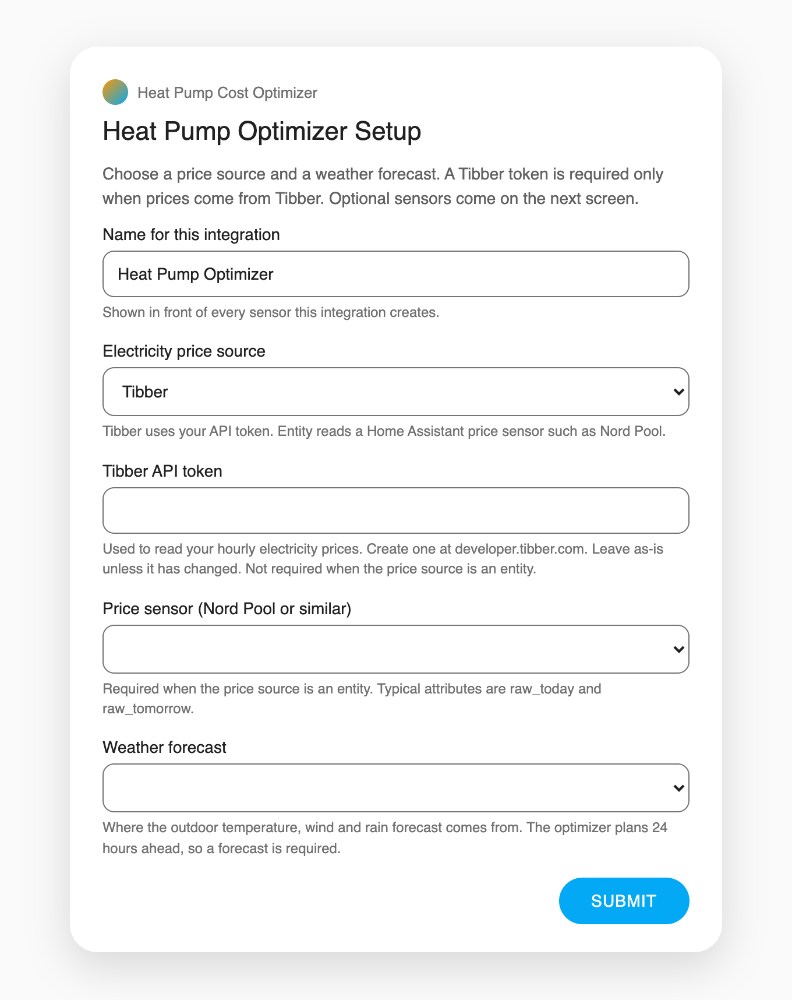
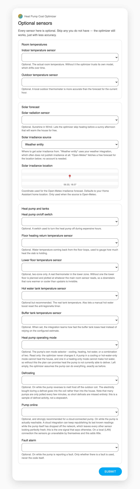
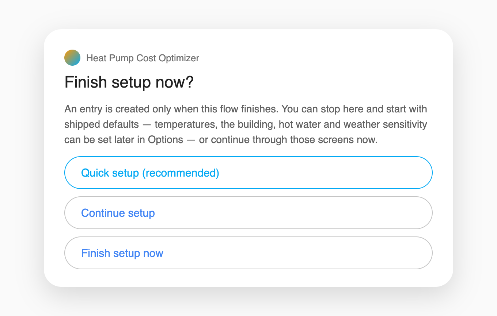
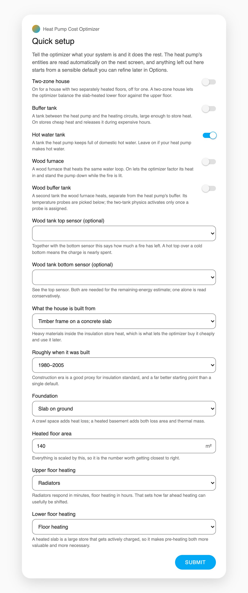
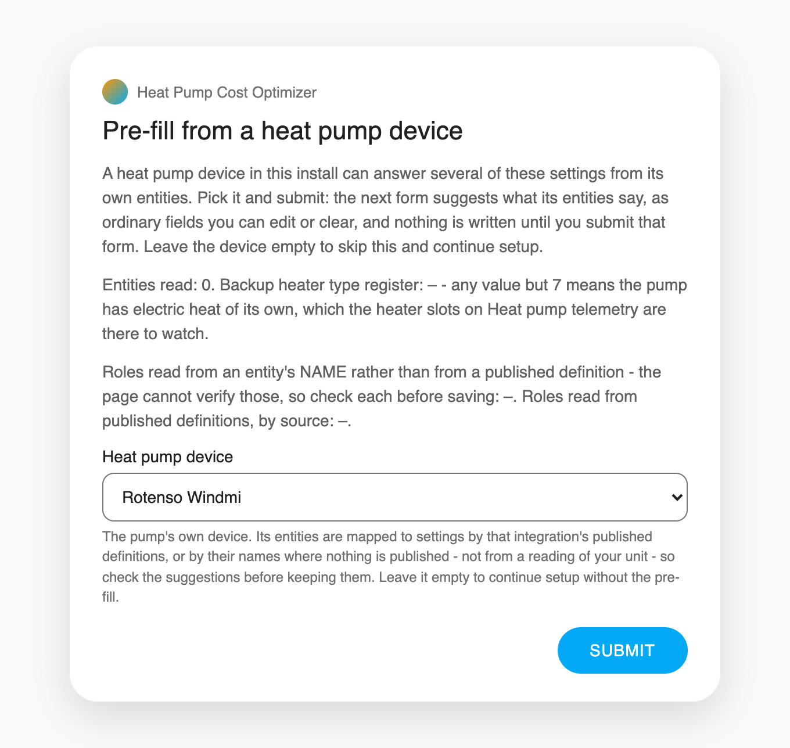
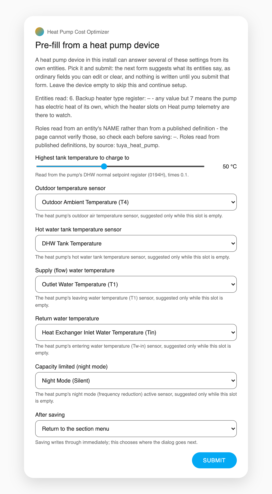
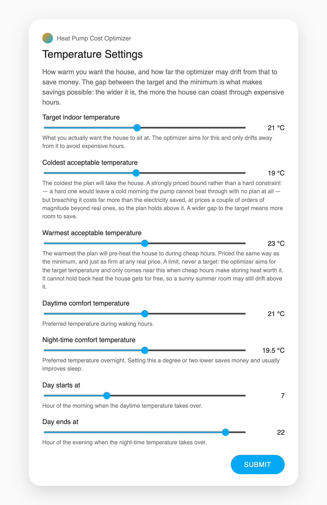
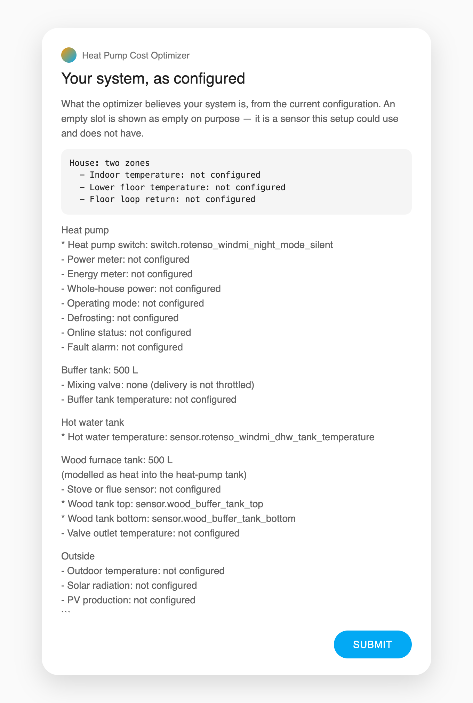

# Setting up the integration

Every screen Home Assistant shows when you add the Heat Pump Cost Optimizer,
in the order you meet it, with a picture of each. Quick setup — the
recommended route since v6.6.5 — collapses the original eleven-page wizard to
one page of questions plus an automatic read of the heat pump's own entities;
the full wizard is still there one menu entry later, and everything either
path sets can be refined afterwards in Options.

This page is the journey. For what every field *means* — defaults, ranges,
and the options pages you return to later — see
[configuration.md](configuration.md), which follows the same order the UI does.

> The pictures below are generated renders built from the integration's own
> form definitions and English texts, so they show the questions and answers
> exactly as the flow asks them. They are not photographs of an install, and
> no real home's data appears in them.

- [Before you start](#before-you-start)
- [Adding the integration](#adding-the-integration)
- [Screen 1 · Price source and weather](#screen-1--price-source-and-weather)
- [Screen 2 · Optional sensors](#screen-2--optional-sensors)
- [The choice: three ways to finish](#the-choice-three-ways-to-finish)
- [Quick setup (recommended)](#quick-setup-recommended)
- [Continue setup — the full wizard](#continue-setup--the-full-wizard)
- [Finish setup now](#finish-setup-now)
- [Already have an entry?](#already-have-an-entry)

---

## Before you start

Have two things to hand:

- **Electricity prices.** Either a Tibber account with an API token (create
  one at [developer.tibber.com](https://developer.tibber.com)), or a Home
  Assistant price sensor such as Nord Pool exposing `raw_today` /
  `raw_tomorrow`.
- **A weather entity.** The optimizer plans 24 hours ahead, so hourly
  forecasts are the one input it will not proceed without. Met.no or similar
  is fine.

Everything else — indoor and outdoor thermometers, tank probes, a power
meter — is optional and can be pointed at later from the options pages.

## Adding the integration

**Settings → Devices & services → Add integration → Heat Pump Cost
Optimizer** (from HACS or a manual install; see the
[README](../README.md#installation) for both).

The first two screens are the only required answers in the whole flow. After
them, the flow asks how you want to finish, and each of the three answers
still ends with a working entry.

## Screen 1 · Price source and weather

*A name, where prices come from, and the weather forecast — the two required
answers of the whole flow.*

| Setting | What it asks |
|---|---|
| Name for this integration | Shown in front of every entity the integration creates. |
| Electricity price source | `Tibber` uses your API token; `Price entity (Nord Pool or similar)` reads a Home Assistant price sensor. |
| Tibber API token | Required only when the source is Tibber. Checked against Tibber before the flow continues — a network failure is reported as a connection problem, not as a bad token. |
| Price sensor (Nord Pool or similar) | Required only when the source is an entity. |
| Weather forecast | Required. Where the outdoor temperature, wind and rain forecast comes from. |

## Screen 2 · Optional sensors

*Every picker here is optional. Skip any you do not have — the optimizer
still works, just with less accuracy.*

The pickers sit in three groups. **Room temperatures** (indoor, outdoor),
**Solar forecast** (an irradiance sensor, or a free Open-Meteo forecast for a
coordinate), and **Heat pump and tanks** — the on/off switch, floor-loop and
tank probes, and the pump's mode, defrost, online and fault signals. The
indoor temperature sensor is the one worth finding first: without it the
optimizer trusts its own model of the room, which drifts over time.

## The choice: three ways to finish

After the two required screens the flow asks **Finish setup now?** — a menu
with three answers:

*Three answers, all of which end with a working entry.*

| Menu entry | What it does |
|---|---|
| **Quick setup (recommended)** | One page of questions about the house, then the heat pump's entities are read automatically. See [below](#quick-setup-recommended). |
| **Continue setup** | The full wizard: temperatures, the building, the heat pump, hot water, weather sensitivity. See [below](#continue-setup--the-full-wizard). |
| **Finish setup now** | Create the entry immediately with shipped defaults, and refine everything later in Options. |

Two things worth knowing about this menu:

- **It belongs to adding a new entry — and, since #1258, to changing one.**
  The menu itself appears only while setting the integration up, but the
  Quick setup questions are also reachable afterwards: open the integration
  and choose **Configure**, where **Quick setup** is the last entry on the
  first menu. It asks the same questions over the entry's existing settings,
  each pre-filled with the entry's own recorded answer: change an answer and
  submit, and the thermal model is re-derived from the questionnaire;
  submit without changing anything and nothing is written. The device
  pre-fill is not offered there, because an existing entry's entity slots
  are already answered — that read stays on the **Pre-fill from a heat
  pump device** page. **Reconfigure** still reopens only the first
  screen and saves back onto the same entry.
- **Quick setup arrived in v6.6.5.** An install set up on an earlier version
  never saw the menu; its entries are complete all the same.

## Quick setup (recommended)

*The whole house in one page: five yes/no questions, the wood-tank probes
when you have that tank, and the same building questionnaire the full wizard
asks.*

Tell the optimizer what your system is and it does the rest. Anything the
page does not ask about — or that you leave at its default — starts from a
sensible value you can refine later in Options.

### The five house questions

| Question | Default | What "yes" means |
|---|---|---|
| Two-zone house | off | The house has two separately heated floors. The optimizer then balances the slab-heated lower floor against the upper floor instead of treating the house as one room. |
| Buffer tank | off | A tank between the heat pump and the heating circuits, large enough to store heat. "Yes" records a store-sized tank (500 litres; the shipped default of 35 litres models a small hydraulic separator, which cannot store a night's heat). On stores cheap heat and releases it during expensive hours. |
| Hot water tank | **on** | A tank the heat pump keeps full of domestic hot water. Leave it on if your heat pump makes hot water; turning it off removes hot water from the plan entirely. |
| Wood furnace | off | A wood furnace heating the same water loop. The optimizer factors its heat in and stands the pump down while the fire is lit. |
| Wood buffer tank | off | A second tank the wood furnace heats, separate from the heat pump's buffer. "Yes" records the tank's volume — and the two probes below it are what actually switch the two-tank physics on. |

The two probe pickers under the wood questions are the wood buffer's own
gate — the volume alone changes nothing the model reads:

- **Wood tank top sensor (optional)** — with the bottom sensor, this says how
  much a fire has left. A hot top over a cold bottom means the charge is
  nearly spent.
- **Wood tank bottom sensor (optional)** — see the top sensor. Both are needed
  for the remaining-energy estimate; one alone is read conservatively.

### The building questionnaire

The six questions below the toggles are the same ones the full wizard asks,
and a house answered here derives the identical physics as one answered
there: what the house is built from, roughly when it was built, the
foundation, the heated floor area (everything is scaled by this, so it is the
number worth getting closest to right), and what each floor is heated by.
These set starting values only — the self-learning model refines them from
how the house actually behaves. The full table of choices is in
[configuration.md](configuration.md#initial-setup).

### The device pre-fill

Submitting the page moves straight to a screen that reads your heat pump's
own entities:

*Pick the pump's device and submit — or leave it empty to skip this and
continue setup.*

A heat pump device in this install can answer several of the settings from
its own entities: the outdoor, tank, flow and return temperature sensors, the
hot water setpoint, and the pump's night-mode switch. Pick the device and
submit, and the next form shows what its entities suggest:

*Ordinary fields you can edit or clear — nothing is written until you submit
this second form. Keep what looks right, clear what does not, and the wizard
continues to the menu.*

The suggestions come from the device integration's published definitions or,
where nothing is published, from the entity names — so check each before
keeping it. The page itself says which is which: any role it filled from a
name is listed under the form, as `role → friendly name (entity id)`, so a
name-matched suggestion can be checked against the entity you recognise.
The fields are the pump's own settings:

| Field | What it fills |
|---|---|
| `dhw_setpoint` | Highest tank temperature to charge to, read from the pump's register. |
| `outdoor_temp_entity` | Outdoor temperature sensor. |
| `dhw_temp_entity` | Hot water tank temperature sensor. |
| `heat_pump_supply_temp_entity` | Supply (flow) water temperature. |
| `heat_pump_return_temp_entity` | Return water temperature. |
| `heat_pump_capacity_limited_entity` | Capacity limited (night mode) switch. |

Two details worth knowing:

- **On the quick path this screen always appears.** Choosing Quick setup is
  itself a request for autodetection, so the device read runs here
  regardless. The *Offer this pre-fill at setup* switch on the
  **Pre-fill from a heat pump device** options page governs only the
  non-quick path, where the same screen appears — off by default — after the
  second screen instead.
- **Leaving the device empty is a decline, not an error.** Nothing is
  written, and the flow continues to the menu. A device whose entities fill
  too few settings is refused on the page rather than shown empty.

## Continue setup — the full wizard

**Continue setup** walks the original pages. The first asks for the
temperatures:

*The gap between the target and the minimum is what makes savings possible:
the wider it is, the more the house can coast through expensive hours.*

After the temperatures the wizard asks how you want to describe your
building — the same questionnaire Quick setup shows, or raw thermal values if
you hold a real energy declaration — then the heat pump's nameplate numbers,
hot water, and weather sensitivity. Every field, default and range on those
pages is documented in [configuration.md](configuration.md#initial-setup);
the same checks that guard the options pages later (a minimum above the
target, a night above the day temperature, and so on) run here too.

## Finish setup now

**Finish setup now** skips the questions and creates the entry with shipped
defaults, showing one last overview of what will be created:

*What the optimizer believes your system is. An empty slot is shown as empty
on purpose — it is a sensor this setup could use and does not have.*

Everything the overview shows can be changed afterwards: open the integration
and choose **Configure**, which presents the 23 options pages described in
[configuration.md](configuration.md#changing-settings-later) — with **Quick
setup** among the everyday pages, for an install that wants to answer the
house questions now — and the
[README](../README.md#changing-settings-after-setup).

## Already have an entry?

The setup flow — including the finish-setup menu — runs when an entry is
*added*. To change an entry that exists:

- **Configure** (Options) re-opens the settings pages: sensors, the building
  and questionnaire, hot water, tariffs, learning — everything the wizard
  asked and more, one page at a time. **Quick setup** is here too, on the
  first menu: the same house questions as at setup, each pre-filled with
  the entry's own recorded answer — change one and submit to re-derive the
  thermal model, or submit untouched and nothing is written.
- **Reconfigure** re-opens just the first screen — a rotated token, a renamed
  sensor, a replacement pump — and saves back onto the same entry, without
  walking the wizard again.

A second heat pump gets a second entry, added through the same flow as the
first.
