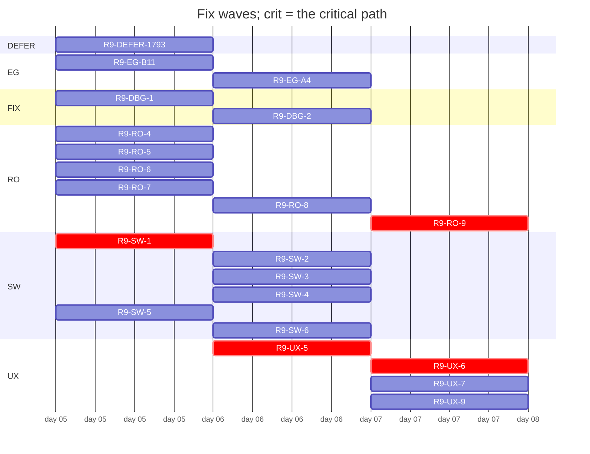

# Plan table (origin/handoff/audit-r9-fixplan)
Generated by `tools/audit/seat/plan_table.py` 2026-10-06; roster origin/handoff/audit-r9-fixplan.

21 open group(s) of 150; 4 wave(s); critical path: R9-SW-1 -> R9-UX-5 -> R9-UX-6 -> R9-RO-9 (4).

## Swimlanes

| lane \ wave | 1 | 2 | 3 | 4 |
|---|---|---|---|---|
| DEFER | R9-DEFER-1793 |  |  |  |
| EG | R9-EG-B11 | R9-EG-A4 |  |  |
| FIX | R9-DBG-1 | R9-DBG-2 |  |  |
| RO | R9-RO-4 R9-RO-5 R9-RO-6 R9-RO-7 | R9-RO-8 |  | R9-RO-9 |
| SW | R9-SW-1 R9-SW-5 | R9-SW-2 R9-SW-3 R9-SW-4 R9-SW-6 |  |  |
| UX |  | R9-UX-5 | R9-UX-6 R9-UX-7 R9-UX-9 |  |

## Waves

## Groups

| group | lane | wave | stage | issues | models | owner gate | what | live note |
|---|---|---|---|---|---|---|---|---|
| R9-F1.1 | F1 | 1 | done | #1646, #1649, **#1665**, **#1683** | opus/opus | - | Round-9 fix PR F1.1 (Coordinator cycle, state and clock lane). |  |
| R9-F1.2 | F1 | 1 | done | #1644, #1651 | opus/opus | - | Round-9 fix PR F1.2 (Coordinator cycle, state and clock lane). |  |
| R9-F1.3 | F1 | 1 | done | #1644 | opus/opus | - | Round-9 fix PR F1.3 (Coordinator cycle, state and clock lane). |  |
| R9-F1.4 | F1 | 1 | done | #1647, **#1662**, **#1681** | opus/opus | - | Round-9 fix PR F1.4 (Coordinator cycle, state and clock lane). |  |
| R9-F1.5 | F1 | 1 | done | #1644, #1651, **#1670**, **#1676**, **#1682** | opus/opus | - | Round-9 fix PR F1.5 (Coordinator cycle, state and clock lane). |  |
| R9-F1.6 | F1 | 1 | done | #1647, **#1659** | opus/opus | - | Round-9 fix PR F1.6 (Coordinator cycle, state and clock lane). |  |
| R9-F1.7 | F1 | 1 | done | #1644, #1649, **#1655**, **#1658** | opus/opus | - | Round-9 fix PR F1.7 (Coordinator cycle, state and clock lane). |  |
| R9-F1.8 | F1 | 1 | done | #1644, **#1657** | opus/opus | - | Round-9 fix PR F1.8 (Coordinator cycle, state and clock lane). |  |
| R9-F1.9 | F1 | 1 | done | **#1660** | sonnet/opus | - | Round-9 fix PR F1.9 (Coordinator cycle, state and clock lane). |  |
| R9-F1.10 | F1 | 1 | done | #1645, **#1654**, **#1741** | opus/opus | - | Round-9 fix PR F1.10 (Coordinator cycle, state and clock lane). |  |
| R9-F1.11 | F1 | 1 | done | **#1644**, **#1651** | opus/opus | - | Round-9 fix PR F1.11 (Coordinator cycle, state and clock lane). |  |
| R9-F2.1 | F2 | 1 | done | #1645, #1654, #1665, **#1666** | opus/opus | - | Round-9 fix PR F2.1 (Solver and plant model lane). |  |
| R9-F2.2 | F2 | 1 | done | #1653 | opus/opus | - | Round-9 fix PR F2.2 (Solver and plant model lane). |  |
| R9-F2.3 | F2 | 1 | done | #1644, #1645, **#1671** | opus/opus | - | Round-9 fix PR F2.3 (Solver and plant model lane). |  |
| R9-F2.5 | F2 | 1 | done | #1653 | opus/opus | - | Round-9 fix PR F2.5 (Solver and plant model lane). |  |
| R9-F2.4 | F2 | 1 | done | #1644, **#1664** | opus/opus | - | Round-9 fix PR F2.4 (Solver and plant model lane). |  |
| R9-F3.1 | F3 | 1 | done | #1644, #1647, #1660 | opus/opus | - | Round-9 fix PR F3.1 (Persisted stores and price/weather feeds lane). |  |
| R9-F3.2 | F3 | 1 | done | #1644, #1647, #1660 | opus/opus | - | Round-9 fix PR F3.2 (Persisted stores and price/weather feeds lane). |  |
| R9-F3.3 | F3 | 1 | done | #1644, #1647, **#1680** | opus/opus | - | Round-9 fix PR F3.3 (Persisted stores and price/weather feeds lane). |  |
| R9-F4.1 | F4 | 1 | done | #1644, **#1673**, **#1684** | opus/opus | - | Round-9 fix PR F4.1 (Inputs, constants, sysid and flow-lift lane). |  |
| R9-F4.2 | F4 | 1 | done | **#1655**, **#1672** | opus/opus | - | Round-9 fix PR F4.2 (Inputs, constants, sysid and flow-lift lane). |  |
| R9-F5.1 | F5 | 1 | done | #1645, #1668, **#1675**, **#1688** | sonnet/opus | - | Round-9 fix PR F5.1 (Config flow and translated text lane). |  |
| R9-F5.2 | F5 | 1 | done | #1644, #1651, **#1679**, **#1685** | sonnet/opus | - | Round-9 fix PR F5.2 (Config flow and translated text lane). |  |
| R9-F6.1 | F6 | 1 | done | #1652 | sonnet/opus | - | Round-9 fix PR F6.1 (Dashboard card lane). |  |
| R9-F6.2 | F6 | 1 | done | #1645, #1652, **#1677** | sonnet/opus | - | Round-9 fix PR F6.2 (Dashboard card lane). |  |
| R9-F6.3 | F6 | 1 | done | **#1652** | sonnet/opus | yes: tests/card_browser.mjs is code-owned (decisions given under the 2026-09-29 mandate; the approving review at the head remains a GitHub requirement) | Round-9 fix PR F6.3 (Dashboard card lane). |  |
| R9-F6.4 | F6 | 1 | done | **#1687** | sonnet/opus | - | Round-9 fix PR F6.4 (Dashboard card lane). |  |
| R9-F7.1 | F7 | 1 | done | #1644, #1683 | sonnet/opus | - | Round-9 fix PR F7.1 (Entities lane). |  |
| R9-F7.2 | F7 | 1 | done | #1644, **#1669** | sonnet/opus | - | Round-9 fix PR F7.2 (Entities lane). |  |
| R9-F8.1 | F8 | 1 | done | #1645, **#1674** | sonnet/opus | - | Round-9 fix PR F8.1 (User documentation lane). |  |
| R9-F8.2 | F8 | 1 | done | #1645 | sonnet/opus | - | Round-9 fix PR F8.2 (User documentation lane). |  |
| R9-F8.3 | F8 | 1 | done | #1645, #1649, **#1668** | sonnet/opus | - | Round-9 fix PR F8.3 (User documentation lane). |  |
| R9-F9.1 | F9 | 1 | done | #1646 | sonnet/opus | - | Round-9 fix PR F9.1 (Test pins for unpinned guards lane). |  |
| R9-F9.2 | F9 | 1 | done | #1646, **#1678** | sonnet/opus | - | Round-9 fix PR F9.2 (Test pins for unpinned guards lane). |  |
| R9-F9.3 | F9 | 1 | done | **#1647** | opus/opus | - | Round-9 fix PR F9.3 (Test pins for unpinned guards lane). |  |
| R9-F10.1 | F10 | 1 | done | #1649 | opus/opus | - | Round-9 fix PR F10.1 (Gate, stub and ratchet infrastructure lane). |  |
| R9-F10.1b | F10 | 1 | done | **#1649**, #1740 | sonnet/opus | - | Round-9 fix PR F10.1b (Gate, stub and ratchet infrastructure lane). |  |
| R9-F10.2 | F10 | 1 | done | **#1653**, **#1656** | opus/opus | yes: tests/stress.py is code-owned; the loop_cpu_ratio entry and the valve rows are allowed (cards B1, B2) and still merge only on tvofi's approving review (budget-raise-gate) (decisions given under the 2026-09-29 mandate; the approving review at the head remains a GitHub requirement) | Round-9 fix PR F10.2 (Gate, stub and ratchet infrastructure lane). |  |
| R9-F10.3 | F10 | 1 | done | **#1646**, **#1663**, **#1748** | opus/opus | yes: tests/env_drift.py, tests/stress.py, tests/mutation_table.py, tests/closure.py and tests/derive_closures.sh are code-owned; the I1 prototype derives its counts at both ends and raises no mutation_budgets.json entry (decisions given under the 2026-09-29 mandate; the approving review at the head remains a GitHub requirement) | Round-9 fix PR F10.3 (Gate, stub and ratchet infrastructure lane). |  |
| R9-F10.4 | F10 | 1 | done | **#1645**, #1650, **#1661**, **#1686**, **#1738** | opus/opus | yes: D7-s1-01 prices coordinator state reached through module-level helpers; tvofi allowed raising the coordinator structure budgets if the honest re-record raises them (card B5), to the measured value, and the raise merges only on tvofi's approving review (decisions given under the 2026-09-29 mandate; the approving review at the head remains a GitHub requirement) | Round-9 fix PR F10.4 (Gate, stub and ratchet infrastructure lane). |  |
| R9-F10.4b | F10 | 1 | done | **#1841** | sonnet/opus | - | Round-9 fix PR F10.4b (Gate, stub and ratchet infrastructure lane), added 2026-10-02 at tvofi's request; issue #1841. |  |
| R9-F10.5 | F10 | 1 | done | #1897 | opus/opus | yes: tvofi chose to build it (card C5); it needs a new writer identity under decision 0011, whose App and credential are a Mac/tvofi action, and tests.yml, tests/mutation_table.py and the decision are code-owned (decisions given under the 2026-09-29 mandate; the approving review at the head remains a GitHub requirement) | Round-9 fix PR F10.5 (Gate, stub and ratchet infrastructure lane). |  |
| R9-F10.6 | F10 | 1 | done | #1898 | opus/opus | yes: tvofi commissioned it (card C6); tests/mutation_table.py is code-owned, and any mutation_budgets.json change merges only on tvofi's approving review (decisions given under the 2026-09-29 mandate; the approving review at the head remains a GitHub requirement) | Round-9 fix PR F10.6 (Gate, stub and ratchet infrastructure lane). |  |
| R9-F11.1 | F11 | 1 | done | #1648, #1650 | sonnet/opus | - | Round-9 fix PR F11.1 (Governance tooling and policy lane). |  |
| R9-F11.2 | F11 | 1 | done | #1648 | opus/opus | yes: workflows, CODEOWNERS and budget_raise_gate.py are code-owned | Round-9 fix PR F11.2 (Governance tooling and policy lane). |  |
| R9-F11.3 | F11 | 1 | done | #1645, **#1648** | opus/opus | yes: policy (CLAUDE.md, .claude/rules) and governance.yml are code-owned | Round-9 fix PR F11.3 (Governance tooling and policy lane). |  |
| R9-F11.6 | F11 | 1 | done | **#1667** | opus/opus | yes: tvofi chose to build it (card C18); fix-review.md is policy and web-fix-wave.js is code-owned | Round-9 fix PR F11.6 (Governance tooling and policy lane). |  |
| R9-F11.4 | F11 | 1 | done | **#1650** | sonnet/opus | yes: audit-find.js is code-owned (decisions given under the 2026-09-29 mandate; the approving review at the head remains a GitHub requirement) | Round-9 fix PR F11.4 (Governance tooling and policy lane). |  |
| R9-F11.5 | F11 | 1 | done | #1899 | sonnet/opus | yes: policy: tools/audit/briefs, .claude/rules and tests/README.md are code-owned; tvofi approved all nine drafts (cards A1-A9) and reviews the PR at its head before it merges (decisions given under the 2026-09-29 mandate; the approving review at the head remains a GitHub requirement) | Round-9 fix PR F11.5 (Governance tooling and policy lane). |  |
| R9-EG-B0 | EG | 1 | rca-done | #1736 | opus/opus | - | Round-9 endgame seat EG-B0 (lane EG, architecture: root cause of the solve-scoped hub writes). |  |
| R9-EG-B2 | EG | 1 | done | #1739, **#1742** | opus/opus | - | Round-9 endgame PR EG-B2 (lane EG, architecture: surface identity and public accessors). |  |
| R9-EG-B3 | EG | 1 | done | **#1737** | sonnet/opus | - | Round-9 endgame PR EG-B3 (lane EG, architecture: typed payload contract). |  |
| R9-EG-B3b | EG | 1 | done | **#1737** | sonnet/opus | - | Round-9 endgame PR EG-B3b (lane EG, architecture: the typed payload contract, remainder). |  |
| R9-EG-B4 | EG | 1 | done | **#1740** | opus/opus | - | Round-9 endgame PR EG-B4 (lane EG, architecture: store version seam). |  |
| R9-EG-B1 | EG | 1 | done | **#1736** | opus/opus | yes: any structure-budget raise needs tvofi's confirmation before the push (CLAUDE.md rule 2) (decisions given under the 2026-09-29 mandate; the approving review at the head remains a GitHub requirement) | Round-9 endgame PR EG-B1 (lane EG, architecture: per-solve immutable inputs). |  |
| R9-EG-B6 | EG | 1 | done | **#1739** | sonnet/opus | - | Round-9 endgame PR EG-B6 (lane EG, architecture: collaborator interfaces). |  |
| R9-EG-B8 | EG | 1 | done | **#1747** | opus/opus | - | Round-9 endgame PR EG-B8 (lane EG, architecture: the DHW block ignored by the co-optimisation replan). |  |
| R9-EG-B5a | EG | 1 | done | #1743 | opus/opus | yes: a structure-budget re-record (downward) with the reason in the commit message (decisions given under the 2026-09-29 mandate; the approving review at the head remains a GitHub requirement) | Round-9 endgame PR EG-B5a (lane EG, architecture: one builder for the duplicated solve closures). |  |
| R9-EG-B5 | EG | 1 | done | **#1743**, #1748 | opus/opus | yes: tvofi opted in (2026-09-28); a classes_over_300 increase, unless R9-F10.4 re-defined it per #1738 arm (c), needs tvofi's confirmation before the push (decisions given under the 2026-09-29 mandate; the approving review at the head remains a GitHub requirement) | Round-9 endgame PR EG-B5 (lane EG, architecture: DHW planner extraction, opted in). |  |
| R9-EG-B7 | EG | 1 | done | **#1744** | opus/opus | yes: a classes_over_300 increase, unless R9-F10.4 re-defined it, needs tvofi's confirmation before the push (decisions given under the 2026-09-29 mandate; the approving review at the head remains a GitHub requirement) | Round-9 endgame PR EG-B7 (lane EG, architecture: coordinator seams, conditional). |  |
| R9-EG-B9 | EG | 1 | done | **#1752**, **#1753** | opus/opus | - | Round-9 endgame PR EG-B9 (lane EG, behaviour fix in the F1 serial slot: class N-shared-config outside the three hubs). |  |
| R9-EG-B10 | EG | 1 | done | **#1754**, **#1755** | opus/opus | - | Round-9 endgame PR EG-B10 (lane EG, behaviour fix: the solve lifecycle). |  |
| R9-EG-R0 | EG | 1 | done | #1759 | sonnet/opus | yes: tvofi reviews the register v2 move list and REGISTER-V2.md's open questions before merge | Round-9 endgame PR EG-R0 (lane EG, register data). |  |
| R9-EG-R1 | EG | 1 | done | **#1759** | sonnet/opus | yes: policy (judge.md, defect-root-cause.md) and code-owned audit-verify.js: tvofi's confirmation before the push and approving review at the head (decisions given under the 2026-09-29 mandate; the approving review at the head remains a GitHub requirement) | Round-9 endgame PR EG-R1 (lane EG, the permanent register fold). |  |
| R9-F10.1c | F10 | 1 | done | **#1756** | sonnet/opus | - | Round-9 fix PR F10.1c (gate infrastructure, class P7 barrier completion). |  |
| R9-F10.1d | F10 | 1 | done | #1900 | sonnet/opus | - | Round-9 fix PR F10.1d (P7 DST raw-site sweep), added 2026-10-01 by the Mac orchestrator on F10.1c's hand-off. |  |
| R9-F10.1e | F10 | 1 | done | #1901 | sonnet/opus | - | Round-9 fix PR F10.1e (P7 DST fold-straddle fixes, second sweep), added 2026-10-01 by the Mac orchestrator on F10.1d's round-1 rework. |  |
| R9-F10.8 | F10 | 1 | done | #1902 | sonnet/opus | - | Round-9 fix PR F10.8 (claims baseline: carried claim lines read as no-claim), added 2026-10-01 by the Mac orchestrator. |  |
| R9-F10.9 | F10 | 1 | done | #1812 | sonnet/opus | - | Round-9 fix PR F10.9 (PR-gate scoping waste, part 1 of #1812), added 2026-10-01 from the CI scoping audit tvofi asked for (report: project thread cmsg_01EL5j... |  |
| R9-F10.9b | F10 | 1 | done | **#1812** | sonnet/opus | - | Round-9 fix PR F10.9b (PR-gate efficiency, part 2 of #1812; closes it). |  |
| R9-F10.11 | F10 | 1 | done | #1903 | sonnet/opus | - | Round-9 fix PR F10.11 (standing CI flake, urgent; split out of F10.9b on 2026-10-01). |  |
| R9-PROC-1 | F10 | 1 | done | #1904 | sonnet/opus | - | Round-9 process change PROC-1 (review items 1, 4, 8 and the brief half of 6; the orchestrator already works this way since 16:51Z, this PR writes it into pol... |  |
| R9-F10.9c | F10 | 1 | done | #1905 | sonnet/opus | - | Round-9 fix PR F10.9c (process-review items 2 and 3; item 2 BOTH arms, tvofi: 'On 2, I want both'). |  |
| R9-F10.9d | F10 | 1 | done | #1812 | sonnet/opus | - | Round-9 fix PR F10.9d (closure recorder: run_always reads), added 2026-10-01 from F10.9c's forward-carry (#1823 body). |  |
| R9-PROC-3 | F10 | 1 | done | #1906 | sonnet/opus | - | Round-9 process change PROC-3 (review item 6's prepr half, item 7, and item 5's setup-script draft). |  |
| R9-PROC-4 | F10 | 1 | done | #1907 | sonnet/opus | - | Round-9 process change PROC-4 (review item 9: git as the bus; after PROC-3 lands item 7's orphan body ref). |  |
| R9-PROC-5 | F10 | 1 | done | #1908 | sonnet/opus | - | Round-9 process change PROC-5 (review item 10). |  |
| R9-F10.10 | F10 | 1 | done | #1909 | sonnet/opus | - | Round-9 fix PR F10.10 (nightly-status false ABSENT), added 2026-10-01 by the Mac orchestrator after the fact: tests/nightly_status.py reported NIGHTLY ABSENT... |  |
| R9-F10.7 | F10 | 1 | done | **#1758** | opus/opus | - | Round-9 fix PR F10.7 (gate infrastructure, diagnostic). |  |
| R9-F11.7 | F11 | 1 | done | **#1757** | opus/opus | yes: tests.yml is code-owned: merges on tvofi's approving review (decisions given under the 2026-09-29 mandate; the approving review at the head remains a GitHub requirement) | Round-9 fix PR F11.7 (governance, the #1721 RCA countermeasure). |  |
| R9-F7.4 | F7 | 1 | done | **#1760** | sonnet/opus | - | Round-9 fix PR F7.4 (entities, class N-name-sort barrier). |  |
| R9-EG-A1 | EG | 1 | done | #1774, #1738 | sonnet/opus | yes: decided: R3-1 adopted and R3-3 weights accepted (2026-09-29); the PR template and tests are code-owned, so the merge takes tvofi's approving review at the head (a GitHub requirement, not a pending decision) (decisions given under the 2026-09-29 mandate; the approving review at the head remains a GitHub requirement) | Round-9 endgame PR EG-A1 (lane EG, the architecture score, report-only). |  |
| R9-EG-A2 | EG | 1 | done | **#1775** | opus/opus | - | Round-9 endgame PR EG-A2 (lane EG, one copy per formula and helper; classes P2 and P3). |  |
| R9-EG-A3 | EG | 1 | done | **#1776** | sonnet/opus | - | Round-9 endgame PR EG-A3 (lane EG, parameter objects). |  |
| R9-F7.5 | F7 | 1 | done | **#1777** | sonnet/opus | - | Round-9 fix PR F7.5 (entities, class N-name-sort). |  |
| R9-EG-L0 | EG | 1 | done | **#1167**, **#1168**, **#1170**, **#1171**, **#1173**, **#1174**, **#1175**, **#1176**, **#1177**, **#1178**, **#1179**, **#1180**, **#1181**, **#1182**, **#1183**, **#1184**, **#1185**, **#1187**, **#1188**, **#1189**, **#1190**, **#1191**, **#1193**, **#1196**, **#1197**, **#1198**, **#1199**, **#1200**, **#1201**, **#1204**, #1655 | opus/opus | - | Round-9 record PR EG-L0 (lane EG, legacy issues). |  |
| R9-EG-B11 | EG | 1 | in-flight | **#1745** | opus/opus | - | Round-9 endgame PR EG-B11 (lane EG, typed entry configuration). |  |
| R9-EG-A4 | EG | 2 | not-started | **#1774** | sonnet/opus | - | Round-9 endgame PR EG-A4 (lane EG, the architecture score becomes a required check). |  |
| R9-SW-1 | SW | 1 | in-flight | #1910 | opus/opus | yes: a structure-budget raise is confirmed by tvofi (D3, 2026-09-30) and merges only on tvofi's approving review at the head | Round-9 feature PR SW-1 (lane SW, silent windows: model and plan). |  |
| R9-SW-2 | SW | 2 | not-started | #1911 | opus/opus | yes: a structure-budget raise is confirmed by tvofi (D3, 2026-09-30) and merges only on tvofi's approving review at the head | Round-9 feature PR SW-2 (lane SW, silent windows: actuation). |  |
| R9-SW-3 | SW | 2 | not-started | #1912 | sonnet/opus | yes: a structure-budget raise is confirmed by tvofi (D3, 2026-09-30) and merges only on tvofi's approving review at the head | Round-9 feature PR SW-3 (lane SW, silent windows: card and docs). |  |
| R9-SW-4 | SW | 2 | not-started | #1913 | sonnet/opus | yes: a structure-budget raise is confirmed by tvofi (D3, 2026-09-30) and merges only on tvofi's approving review at the head | Round-9 feature PR SW-4 (lane SW, silent windows on the GCHV Modbus package). |  |
| R9-RO-1 | RO | 1 | done | #1914 | opus/opus | yes: new test script: tests/run.sh and tests/derive_closures.sh are code-owned, and the manifest gets a CODEOWNERS line; merges on tvofi's approving review at the head | Round-9 reorganisation PR RO-1 (lane RO, the layout barrier, report-only). |  |
| R9-RO-2 | RO | 1 | done | #1915 | opus/opus | yes: code-owned: .github/workflows, budget_raise_gate.py, contract_rerun.py, tools/release/stamp.py; merges on tvofi's approving review at the head | Round-9 reorganisation PR RO-2 (lane RO, dual-path instruments). |  |
| R9-RO-3 | RO | 1 | done | #1916 | sonnet/opus | yes: tests/closure.py is code-owned; merges on tvofi's approving review at the head | Round-9 reorganisation PR RO-3 (lane RO, product docs). |  |
| R9-RO-4 | RO | 1 | in-flight | #1917 | opus/opus | yes: policy: the ADR superseded-by corrections, tools/audit/README.md and tools/audit/harnesses/README.md, and policy_budgets.json roles.record.opens (it names a roster being archived; budget-raise-gate); merges on tvofi's approving review at the head | Round-9 reorganisation PR RO-4 (lane RO, archive and merge). |  |
| R9-RO-5 | RO | 1 | in-flight | #1918 | opus/opus | yes: policy and budget: CLAUDE.md, AGENTS.md, .claude/rules, tools/audit/briefs, docs/decisions, the steward skill, the PR template, policy_budgets.json and policy_known_bad.json re-keyed (budget-raise-gate reads a re-keyed roles.opens as a raise); confirm before the push and merge on tvofi's approving review at the head | Round-9 reorganisation PR RO-5 (lane RO, the governance and programme lift). |  |
| R9-RO-6 | RO | 1 | in-flight | #1919 | sonnet/opus | yes: code-owned: .github/workflows, .claude/hooks, CODEOWNERS, budget_raise_gate.py, contract_rerun.py; merges on tvofi's approving review at the head | Round-9 reorganisation PR RO-6 (lane RO, instruments). |  |
| R9-RO-7 | RO | 1 | in-flight | #1920 | sonnet/opus | yes: the codeowners_gap harness is restored by the governance jobs and is code-owned through them; merges on tvofi's approving review at the head | Round-9 reorganisation PR RO-7 (lane RO, harness roots found, not counted). |  |
| R9-RO-8 | RO | 2 | not-started | #1921 | opus/opus | yes: code-owned: tests/closure.py, tests/env_drift.py, tools/release/stamp.py, the codeowners_gap harness; merges on tvofi's approving review at the head | Round-9 reorganisation PR RO-8 (lane RO, audit evidence). |  |
| R9-RO-9 | RO | 4 | not-started | #1922 | sonnet/opus | yes: policy and code-owned: .github/workflows and the required-context list (a repository-settings change only tvofi applies; the orchestrator requests and records it on #201); merges on tvofi's approving review at the head | Round-9 reorganisation PR RO-9 (lane RO, finish and enforce). |  |
| R9-UI-1 | UI | 1 | done | #1791 | sonnet/opus | yes: tests/layout.json is code-owned (the new folder's glob); merges on tvofi's approving review at the head | Round-9 feature PR UI-1 (lane UI, brand identity). |  |
| R9-UI-2 | UI | 1 | done | #1791 | sonnet/opus | yes: tests/layout.json is code-owned (the new folder's glob); merges on tvofi's approving review at the head | Round-9 feature PR UI-2 (lane UI, README graphics). |  |
| R9-UI-3 | UI | 1 | done | #1791 | opus/opus | yes: tests/card_browser.mjs is code-owned; merges on tvofi's approving review at the head | Round-9 feature PR UI-3 (lane UI, card visual system). |  |
| R9-UI-4 | UI | 1 | done | #1791 | opus/opus | yes: tests/card_browser.mjs is code-owned; merges on tvofi's approving review at the head | Round-9 feature PR UI-4 (lane UI, plan chart concept A, palette, colour-vision gate). |  |
| R9-UX-1 | UX | 1 | done | #1795 | sonnet/opus | yes: tests/card_browser.mjs is code-owned; merges on tvofi's approving review at the head | Round-9 feature PR UX-1 (lane UX, why now, why not). |  |
| R9-UX-2 | UX | 1 | done | #1795 | sonnet/opus | yes: tests/card_browser.mjs is code-owned; merges on tvofi's approving review at the head | Round-9 feature PR UX-2 (lane UX, advisor inbox). |  |
| R9-UX-3 | UX | 1 | done | #1795 | sonnet/opus | yes: tests/card_browser.mjs is code-owned; merges on tvofi's approving review at the head | Round-9 feature PR UX-3 (lane UX, health view). |  |
| R9-UX-4 | UX | 1 | done | #1795 | sonnet/opus | yes: none expected; a new test script would need the code-owned tests/run.sh, so tests go in tests/features.py | Round-9 feature PR UX-4 (lane UX, events and blueprint). |  |
| R9-UX-5 | UX | 2 | not-started | #1795 | opus/opus | yes: tests/card_browser.mjs is code-owned; a budget raise, if any, is asked first (U4); merges on tvofi's approving review at the head | Round-9 feature PR UX-5 (lane UX, advisor actions and exact idle reasons). |  |
| R9-UX-6 | UX | 3 | not-started | #1795 | opus/opus | yes: tests/card_browser.mjs is code-owned; a budget raise, if any, is asked first (U4); merges on tvofi's approving review at the head | Round-9 feature PR UX-6 (lane UX, money and memory). |  |
| R9-UX-7 | UX | 3 | not-started | #1795 | opus/opus | yes: tests/card_browser.mjs is code-owned; a budget raise, if any, is asked first (U4); merges on tvofi's approving review at the head | Round-9 feature PR UX-7 (lane UX, model status and diagnostics). |  |
| R9-WEB-1 | WEB | 1 | done | #1798 | sonnet/opus | yes: tests/closure.py and tests/layout.json are code-owned; merges on tvofi's approving review at the head | Round-9 feature PR WEB-1 (lane WEB, the product page and its pin). |  |
| R9-WEB-2 | WEB | 1 | done | **#1798** | sonnet/opus | yes: .github/workflows is code-owned; merges on tvofi's approving review at the head, and tvofi enables Pages (Settings, Pages, Source: GitHub Actions) once before the first dispatch | Round-9 feature PR WEB-2 (lane WEB, the GitHub Pages deploy). |  |
| R9-WEB-3 | WEB | 1 | done | #1798 | sonnet/opus | yes: tests/layout.json, tests/closure.py and .github/CODEOWNERS are code-owned; merges on tvofi's approving review at the head | Round-9 feature PR WEB-3 (lane WEB, documentation sub-pages). |  |
| R9-F10.12 | F10 | 1 | done | #1923 | sonnet/opus | yes: code-owned: .github/workflows/tests.yml; merges on tvofi's approving review at the head | Round-9 fix PR F10.12 (gate infrastructure: the mutation lanes outgrow their timeouts). |  |
| R9-F10.13 | F10 | 1 | done | #1924 | sonnet/opus | yes: code-owned: .github/workflows/tests.yml, and tests/entities.py if arm A is fixed there; merges on tvofi's approving review at the head | Round-9 fix PR F10.13 (gate infrastructure: the mutation lane's instrument findings of 2026-10-03). |  |
| R9-UX-8 | UX | 1 | done | #1925 | sonnet/opus | yes: tests/card_browser.mjs is code-owned; merges on tvofi's approving review at the head | Round-9 feature PR UX-8 (lane UX, narrative rows). |  |
| R9-SW-5 | SW | 1 | in-flight | #1926 | opus/opus | yes: a structure-budget raise, if any, is asked first and merges only on tvofi's approving review at the head | Round-9 feature PR SW-5 (lane SW, timed block switches). |  |
| R9-WEB-4 | WEB | 1 | done | #1927 | sonnet/opus | yes: README.md and docs/ are outside policy; merges on hpo-approver unless a code-owned path is touched | Round-9 docs PR WEB-4 (lane WEB). |  |
| R9-F10.14 | F10 | 1 | done | #1928 | sonnet/opus | yes: tests.yml, run.sh, closure.py and tests/arch_score.py are code-owned or gate files; merges on tvofi approval at head (mandate 5951564627) | Round-9 CI-efficiency PR F10.14. |  |
| R9-F10.15 | F10 | 1 | done | #1929 | sonnet/opus | yes: tests/run.sh, tests/derive_closures.sh, tests.yml and tests/mutation_table.py are @tvofi code-owned gate files (force FULL); merges on tvofi approval at head under mandate 5951564627 | Round-9 CI-efficiency PR F10.15 (CI parallelism), from tvofi's question of 2026-10-03 whether scripts sit needlessly in coverage, closures, mutation or fast. |  |
| R9-F10.16 | F10 | 1 | done | #1930 | sonnet/opus | yes: tests/run.sh, tests/derive_closures.sh, tests.yml and tests/mutation_table.py are @tvofi code-owned gate files (force FULL); merges on tvofi approval at head under mandate 5951564627 | Round-9 CI-efficiency PR F10.16 (mutation driver hygiene), same origin as F10.15. |  |
| R9-RO-2b | RO | 1 | done | #1931 | opus/opus | yes: code-owned: .github/workflows, budget_raise_gate.py, contract_rerun.py, tools/release/stamp.py; merges on tvofi's approving review at the head | Round-9 PR RO-2b, split from #1886 (R9-RO-2). |  |
| R9-WEB-5 | WEB | 1 | done | #1932 | sonnet/opus | - | Owner ask (tvofi, 2026-10-04, folded per the no-pre-study ruling): the README links the product page repo-relative (`docs/index.html`, README lines 16 and 10... |  |
| R9-DIAG-1 | STUDY | 1 | done | #1933 | opus/- | - | Owner field report + study ask (tvofi, 2026-10-04): after 1-2 weeks running the integration, two days of repeated boost space-heating produce a warning that... |  |
| R9-FR-1 | STUDY | 1 | done | #1807, #1825, #1826, #1855, #1860, #1881, #1951 | opus/- | - | pre-study that folds in all friction fixes with good benefit vs cost. |  |
| R9-FR-2 | FIX | 1 | done | #1860 | opus/opus | - | #1860 — prepr.sh gains an ancestry red-check arm: the fix reviewer's root-cause trigger, moved to push time. |  |
| R9-FR-3 | FIX | 1 | done | #1825 | sonnet/sonnet | - | #1825 — the stats counter folds verdict-class sibling families so the threshold sees the family, not only the exact id. |  |
| R9-FR-4 | FIX | 1 | done | #1934 | opus/opus | yes: tests/closure.py is @tvofi code-owned; ci-autofix.md is policy — both merge on the labelled agent approval (mandate 5951564627) after the merge verdict | Carry from R9-RO-2's round 2 (#1886, reviewer-verified): a Darwin `--single` recording of any script whose Linux recording carries inert_reads DROPS them (cl... |  |
| R9-DIAG-1F | FIX | 1 | done | #1935 | opus/opus | - | Pre-study R9-DIAG-1 (doc tools/audit/round9/prestudy/boost-drift-prestudy.md on handoff/r9-diag-1 @3c90f86a3, measured): boost space heating corrupts the lea... |  |
| R9-DIAG-2S | FIX | 1 | done | #1936 | opus/opus | - | Feature per the R9-DIAG-1 feasibility verdict (doc section 4): at accuracy_drift warning time, batch-Newton refit house_heat_loss_scale from >=3 settled post... |  |
| R9-FR-5 | FIX | 1 | done | #1937 | sonnet/sonnet | - | prepr's closures recorder defaults to pyenv python3 (3.11), which cannot parse the tree — the recording fails once, the run refuses, and the seat has to re-r... |  |
| R9-DBG-0 | STUDY | 1 | done | #1938 | opus/- | - | tvofi, 2026-10-04, careful pre-study and roster plan for a debugger feature. |  |
| R9-DBG-1 | FIX | 1 | in-flight | #1939 | opus/opus | - | Pre-study R9-DBG-0 (doc tools/audit/round9/prestudy/debugger-prestudy.md on handoff/r9-dbg-0 @eae236d66 - read it fully; its section shapes are this brief's... |  |
| R9-DBG-2 | FIX | 2 | not-started | #1940 | sonnet/opus | - | Pre-study R9-DBG-0 sections 4 and 7: the debugger module self-test orchestration (the priced self-test table in the doc's section 4; 15 minutes total), the d... |  |
| R9-DBG-3 | FIX | 1 | done | #1941 | sonnet/sonnet | - | Pre-study R9-DBG-0 sections 6 and 7: the repo-side debugger harness, confined to tools/replay (unowned; F11 owns tools/audit), importing the existing tests/r... |  |
| R9-FR-6 | FIX | 1 | done | #1943 | sonnet/sonnet | - | merge_train.py's recarry step fails on every PR whose head needs an automatic main absorb — three proven instances today (#1893, #1894, #1896 all stopped at... |  |
| R9-FR-7 | FIX | 1 | done | #1945 | sonnet/sonnet | yes: tests/mutation_table.py is @tvofi code-owned; merges on the labelled agent approval (mandate 5951564627) | parallelise mutation_table.py's pin-measurement drive. |  |
| R9-FR-8 | FIX | 1 | done | #1946 | sonnet/sonnet | - | FOUR new tools under the seat-inventory directory, each stateless (flags for repo, roster ref, output path), each with a self-test, each reading the roster (... |  |
| R9-FR-9 | FIX | 1 | done | #1947 | sonnet/opus | yes: tests/stress.py is code-owned; merges on the labelled agent approval (mandate 5951564627) | today's scheduled nightly (run 37189092011, 08:29Z, at fb11a017) failed in mutation-ledger with MUTATION TABLE REFUSED - the null control (a comment-only edi... |  |
| R9-FR-10 | FIX | 1 | done | **#1952** | sonnet/opus | - | Round-9 tooling PR FR-10 (lane FIX, record-autofix). |  |
| R9-SW-6 | SW | 2 | not-started | **#1955** | opus/opus | - | Round-9 feature PR SW-6 (lane SW, planner power semantics on unmetered installs). |  |
| R9-UX-9 | UX | 3 | not-started | **#1956** | sonnet/opus | - | Round-9 feature PR UX-9 (lane UX, card sensor recommendation). |  |
| R9-RC-PRCONTRACT | fix | 1 | done | - | sonnet/sonnet | - | Root-cause seat (root-cause.md + defect-root-cause.md), dispatched 2026-10-05 after three same-day instances of the pr-contract friction class. |  |
| R9-DEFER-1793 | DEFER | 1 | deferred | #1793 | sonnet/opus | - | Deferred by the owner on 2026-09-30: a feature request for a shared household power budget. |  |
| R9-RC-PRCONTRACT-FIX | fix | 1 | done | - | sonnet/opus | yes: .github/workflows/ is code-owned; owner approval before landing | Fix seat for the countermeasure in tools/audit/rca/R9-RC-PRCONTRACT.md at 50e9dd193306a714ea020c410bc33ce8cd5b9ff8 (analysis PR #1972). |  |
| R9-STAMP-UNBLOCK | fix | 1 | done | - | sonnet/opus | yes: authorising --allow-rowless for the window is the owner's decision; the instrument change is reviewed like any fix | The next stamp is refused by tools/release/stamp.py, and stays refused after Tests goes green, because main's first-parent line since v6.7.16 carries deploy-... |  |
| R9-FR-11 | FIX | 1 | done | #1951 | sonnet/sonnet | - | Pre-study R9-FR-1 round 2 (2026-10-05, under tvofi's 2026-10-04 R9-FR-1 brief; measured at 86dbf0ca; evidence in the round-2 pre-study document on branch han... |  |
| R9-FR-12 | FIX | 1 | done | #1951 | opus/opus | - | Pre-study R9-FR-1 round 2 (2026-10-05, under tvofi's 2026-10-04 R9-FR-1 brief; measured at 86dbf0ca; evidence in the round-2 pre-study document on branch han... |  |

## ETA

Cadence 2 days per wave (`--cadence`); 4 wave(s) of work, total 8 days from wave-1 start.

| wave | groups | starts (day) | ends (day) |
|---|---|---|---|
| 1 | 9 | 0 | 2 |
| 2 | 8 | 2 | 4 |
| 3 | 3 | 4 | 6 |
| 4 | 1 | 6 | 8 |
